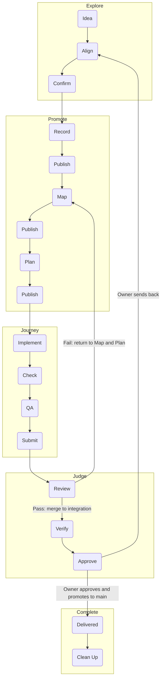

# LLM Workbench - Runbook

**Last reviewed:** 2026-10-01
**Blueprint reviewed:** 2026-09-09
**Runtime owner:** Kayden
**Environment:** local (macOS); public repo `github.com/KaydenClark/LLM_Workbench`

This file explains how to operate, verify, and evaluate the workbench repo
itself. It should be boring, exact, and executable.

## Operations Index

Every session reads this index at entry, then follows only the rows its task
needs. Each row names an operation, when following it is worth it, and the
stable pointer to where its procedure lives.
A row that points to a skill in the tracked skills lane makes that skill part
of the Contract for its operation (`AGENTS.md` Instruction Authority), so a
change to a skill an index row points to, or to an index row, is reviewed as a
Contract change.

| Operation | Follow when | Pointer |
|---|---|---|
| Write agent instructions | You create or edit skills, steering files or references agents reach through pointers. | [writing-for-agents](workbench/skills/writing-for-agents/SKILL.md) |
| Retrospect on a session | The owner explicitly requests a retrospective on a named session or the current one. | [retro](workbench/skills/retro/SKILL.md) |
| Read back a direction | The owner requests `/readback`, grilling is ending, or an implementation handoff needs its understanding checked. | [readback](workbench/skills/readback/SKILL.md) |
| Find a workflow | You need the existing verb sequence, scenario and skill route, and confirmed parent groupings. | [Workflows](#workflows) |
| Enter a session | Every session start or resume: check root, branch and dirty state, run doctor and load the assigned Spec. | [Ordinary Entry](#ordinary-entry) |
| Find the owner of a question | You need the file that owns a permission, meaning, work state, proof or procedure. | [Finding The Owner Of A Question](#finding-the-owner-of-a-question) |
| Route a truth to its owner | Work changed a durable truth and its owner must be updated, or nothing changed and that must be recorded. | [to-docs](workbench/skills/to-docs/SKILL.md#to-docs) |
| Cite a file that changes | A Spec, review or record cites a line of a file that later merges can move. | [to-docs](workbench/skills/to-docs/SKILL.md#citation-anchors) |
| Inspect a GitHub coordination binding | A task asks what a committed repository binding says at an exact commit. | [workbench-room-checks](workbench/skills/workbench-room-checks/SKILL.md#github-coordination-binding-inspection) |
| Coordinate roles and stances | You plan, dispatch, monitor or verify work as a role or a named stance. | [Role And Stance Coordination](#role-and-stance-coordination) |
| Choose the behavior for a request | A request arrives in ordinary language and you must pick the skills and endpoint it authorizes. | [Behavior Selection](#behavior-selection) |
| Freeze a version label | You stamp or change a version label or the core bundle. | [workbench-release](workbench/skills/workbench-release/SKILL.md#release-identity) |
| Upgrade the reference Template for a release | A new Workbench version is being made release-ready. | [workbench-release](workbench/skills/workbench-release/SKILL.md#template-upgrade-release-gate) |
| Check prerequisites | A fresh machine or clone needs its required tools confirmed. | [Prerequisites](#prerequisites) |
| Install | You set up a fresh clone. | [Install](#install) |
| Run locally | You run the evaluator and self-tests by hand. | [Run Locally](#run-locally) |
| Run the tests | A change to tools, templates, specs or root docs needs its fast check or the full suite. | [Test And Build](#test-and-build) |
| Install or recover this repository's hook | LLM_Workbench needs its fast staged checks installed, updated or removed. | [CI And Local Hooks](#ci-and-local-hooks) |
| Verify a behavior change | A behavior change needs its red/green test, its targeted test and the full suite before its result is claimed. | [implement](workbench/skills/implement/SKILL.md#engineering-and-verification); this room's suite: [Test And Build](#test-and-build) |
| Prepare project evidence and Blueprint questions | Genesis or adoption needs evidence and Blueprint questions from a named evidence room. | [workbench-release](workbench/skills/workbench-release/SKILL.md#prepare-project-evidence-and-blueprint-questions) |
| Derive a fresh room from recorded decisions | A release must prove a room regenerates from its recorded decisions. | [workbench-release](workbench/skills/workbench-release/SKILL.md#derive-a-fresh-room-from-recorded-decisions) |
| Check the skills lane | Core skills, their discovery roots or the lane receipt changed or look stale. | [workbench-room-checks](workbench/skills/workbench-room-checks/SKILL.md#skills-lane-check) |
| Publish to the personal catalog | The owner asks to back up skills to, or take one from, the personal catalog. | [workbench-release](workbench/skills/workbench-release/SKILL.md#personal-catalog-publication) |
| Check the support root | Genesis creates or validation checks a room's declared support root and lanes. | [workbench-room-checks](workbench/skills/workbench-room-checks/SKILL.md#v3-support-root-check) |
| Check the managed runtime tools | Runtime tools changed, or a room's installed copies need install, update or verification. | [workbench-room-checks](workbench/skills/workbench-room-checks/SKILL.md#managed-runtime-tools-check) |
| Classify a room's lifecycle route | Before choosing Genesis, adoption, upgrade or update for a room. | [workbench-room-checks](workbench/skills/workbench-room-checks/SKILL.md#room-lifecycle-classification-check) |
| Check an adoption migration | An existing project is adopted into the support-root layout. | [workbench-room-checks](workbench/skills/workbench-room-checks/SKILL.md#v3-adoption-migration-check) |
| Report control fidelity | After adoption or an update-harness run, compare a room's controls with the templates. | [workbench-room-checks](workbench/skills/workbench-room-checks/SKILL.md#control-fidelity-report) |
| Upgrade a v2 room explicitly | A v2-root room moves onto the support root, or that move needs recovery. | [workbench-room-checks](workbench/skills/workbench-room-checks/SKILL.md#v3-explicit-upgrade-and-recovery-check) |
| Check Workbench self-drift | Before and after any update to this Workbench. | [workbench-room-checks](workbench/skills/workbench-room-checks/SKILL.md#workbench-self-drift-check) |
| Check carrier line landing | A rewrite removes lines from `AGENTS.md` or `RUNBOOK.md` and must prove each landed. | [workbench-room-checks](workbench/skills/workbench-room-checks/SKILL.md#carrier-line-landing-check) |
| Deliver a Spec through its lifecycle | You pick up, deliver, review or close an assigned Spec and its Tasks. | [Spec Lifecycle And Retrieval](#spec-lifecycle-and-retrieval) |
| Pick, claim and close a Task | Every pickup or resume of assigned work: selection, claim, receipt, close and blocker rules. | [implement](workbench/skills/implement/SKILL.md#work-selection-and-lifecycle) |
| Implement a sliced Spec | The owner launches the Workbench-only assembly operation; stop with its PR ready for integration review. | [implement-spec](workbench/skills/implement-spec/SKILL.md#steps) |
| Work a Task as Worker | You select, claim, implement, record receipts for, self-check, close and hand back one Task. | [implement](workbench/skills/implement/SKILL.md#worker-selection-implementation-and-hand-back) |
| Review an assembled Spec | A Dispatcher assembles a candidate, or a separate Director reviews it and records the verdict before integration. | [dispatcher](workbench/skills/dispatcher/SKILL.md#dispatcher-and-separate-director-assembled-review) |
| Correct a failed review | A verdict or owner finding failed and its findings return to the still-open Spec. | [dispatcher](workbench/skills/dispatcher/SKILL.md#assembled-review-and-corrective-return) |
| Record owner Human QA and complete | The owner approves delivered work, or main containment must be proven before `complete`. | [director](workbench/skills/director/SKILL.md#owner-human-qa-and-main-before-complete); closure rules: [director](workbench/skills/director/SKILL.md#owner-closure-and-reconciliation) |
| Capture, retire or recover a completed Spec | After `complete`: feature capture, retirement, discard or recovery. | [director](workbench/skills/director/SKILL.md#documentation-feature-capture-retirement-and-recovery); this room's examples: [Documentation: feature capture, retirement and recovery](#documentation-feature-capture-retirement-and-recovery) |
| Deliver a landmark through its lifecycle | You author, assign, nest a Spec or Task under, review, approve or retire a `LANDMARK.md`. | [Landmark Lifecycle](#landmark-lifecycle) |
| Move a Spec into, out of or between landmarks | A Spec gains, changes or drops its parent landmark. | [Landmark Lifecycle](#landmark-lifecycle) |
| Write or accept a decision record | A decision record (ADR or DDR) is proposed, accepted, superseded, deprecated, read, linked or validated. | [to-docs](workbench/skills/to-docs/SKILL.md#decision-records) |
| Prove the composed round trip | Full verification runs, or the composed workflow changed. | [workbench-release](workbench/skills/workbench-release/SKILL.md#composed-round-trip) |
| Check the portability and privacy matrix | A release matrix row or its privacy check changed. | [workbench-release](workbench/skills/workbench-release/SKILL.md#portability-and-privacy-matrix) |
| Prove cross-provider resume | A release gate needs proof that another provider resumes from a clean clone. | [workbench-release](workbench/skills/workbench-release/SKILL.md#cross-provider-resume-proof) |
| Allocate a visible identifier | You need a new Spec, Task, landmark, note or other visible identifier. | [workbench-runtime](workbench/skills/workbench-runtime/SKILL.md#visible-identifiers) |
| Deploy an optional project Grill Board | The owner authorizes installing the existing Board in an adopted project. | [Optional project Grill Board](workbench/docs/project-grill-board.md) |
| Answer or process the Grill Board | The owner answers pending items (Spec gates, decisions, cards, decision-record texts) as a package, or an agent carries his saved answers into their owners and marks them applied. | [Grill Board](workbench/grill-board/README.md#grill-board) |
| Use the Landmark Tracker | Concept understanding (DQCs, landmarks) changes, or the Tracker view is needed. | [notepad](workbench/skills/notepad/SKILL.md#landmark-tracker-accepted-design-and-available-operations) |
| Keep a JSON notepad | Meaningful work needs a local note created, resumed, appended, trimmed or cleaned up. | [notepad](workbench/skills/notepad/SKILL.md#runtime-reference) |
| Transfer work through a handoff | Work goes to another agent or chat as a job, investigation, report or update. | [handoff](workbench/skills/handoff/SKILL.md#transfer-procedure) |
| Transport sessions privately | Private session transport is configured and selected collections must sync. | [save](workbench/skills/save/SKILL.md#optional-private-session-transport) |
| Save, promote or add a room-local skill | Authorized work must be saved to its owners, or a room adds its own skill. | [save](workbench/skills/save/SKILL.md#how-save-and-promote-compose); room-local skills: [workbench-runtime](workbench/skills/workbench-runtime/SKILL.md#room-local-skills) |
| Promote claims to an owner | Selected supported claims must reach their durable owner. | [promote](workbench/skills/promote/SKILL.md#command-reference) |
| Promote one confirmed decision | An assigned decision or confirmed handoff must reach records, Specs, authorized Task plans and integration, or its nearer endpoint. | [promote-decision](workbench/skills/promote-decision/SKILL.md#steps); Workbench-only maintainer operation |
| Trace a name, boundary or relationship before it settles | While aligning or reworking a concept, a proposed term, boundary or relationship needs its conflicts challenged and its consequences in owners, Specs, source and tests shown before the owner chooses. | [domain-modeling](workbench/skills/domain-modeling/SKILL.md#domain-modeling) |
| Read frozen checkpoints or recovery receipts | A legacy checkpoint is cited, or a recovery receipt or backup is needed. | [checkpoint](workbench/skills/checkpoint/SKILL.md#frozen-history-and-operational-recovery) |
| Validate the Wiki | A Wiki page changed or must move to another collection, or doctor reports a Wiki finding. | [workbench-runtime](workbench/skills/workbench-runtime/SKILL.md#wiki-validation) |
| Lint the Wiki | A Wiki update is ending (lint the pages it touched), or a Spec's work is verified and its review begins (lint the whole Wiki). | [Wiki Lint](#wiki-lint) |
| Repair installed state | doctor reports installed state that a room command rewrites. | [workbench-runtime](workbench/skills/workbench-runtime/SKILL.md#installed-state-the-harness-wrote) |
| Read a diagnostic and its blocking effect | A runtime tool reports a finding and you need its severity and what it blocks. | [workbench-runtime](workbench/skills/workbench-runtime/SKILL.md#diagnostics-and-blocking-effects) |
| Use the socket contract registry | Work touches the Foundry socket contract registry. | [workbench-room-checks](workbench/skills/workbench-room-checks/SKILL.md#socket-contract-registry) |
| Hold test coverage | You add or change tests, or judge whether coverage is enough. | [implement](workbench/skills/implement/SKILL.md#test-coverage-policy); this room's policy for the evaluator and trial tooling: [Test Coverage Policy](#test-coverage-policy) |
| Evaluate a harness change | You must show that a harness change is an improvement. | [improve-harness](workbench/skills/improve-harness/SKILL.md#improve-harness); comparative claims and trials: [workbench-evaluation](workbench/skills/workbench-evaluation/SKILL.md#workbench-evaluation) |
| Run the guardrail audit | A harness change needs its guardrail baseline and after-score. | [implement](workbench/skills/implement/SKILL.md#benchmark-driven-improvement); this room's audit: [Guardrail North-Star Audit](#guardrail-north-star-audit) |
| Pick the claims to test | An evaluation must name the claim it tests. | [workbench-evaluation](workbench/skills/workbench-evaluation/SKILL.md#claims-to-test) |
| Design an evaluation | You set up task-outcome scoring or trials. | [workbench-evaluation](workbench/skills/workbench-evaluation/SKILL.md#evaluation-design) |
| Run the evaluation commands | You run the static rubric or the trial framework. | [workbench-evaluation](workbench/skills/workbench-evaluation/SKILL.md#commands) |
| Take in harness feedback | Feedback arrives from a downstream room. | [improve-harness](workbench/skills/improve-harness/SKILL.md#taking-in-feedback); this repository's harvest steps: [workbench-evaluation](workbench/skills/workbench-evaluation/SKILL.md#harness-feedback-loop) |
| Run the automated feedback gate | Scheduled feedback automation runs or is configured. | [workbench-evaluation](workbench/skills/workbench-evaluation/SKILL.md#automated-feedback-gate) |
| Record an automation run outcome | A scheduled run finished and its outcome must be recorded. | [workbench-evaluation](workbench/skills/workbench-evaluation/SKILL.md#automation-run-outcomes) |
| Write a PR body | A change needs its pull request description: a small visual summary, actual before/after evidence and merge danger. The skill authors the body only; opening, merging and branch cleanup stay with implement and this Runbook's Version-Control Procedures. | [pr](workbench/skills/pr/SKILL.md); open, merge and clean up: [implement](workbench/skills/implement/SKILL.md#version-control-procedures) and [Version-Control Procedures](#version-control-procedures) |
| Branch and open a pull request | You create a task branch or open a PR into integration, or need this room's Git commands. | [implement](workbench/skills/implement/SKILL.md#version-control-procedures); this room's commands: [Version-Control Procedures](#version-control-procedures) |
| Merge, prove containment and clean up a branch | A Task's merge answers are validated, or an assembled Spec candidate's Verify review passed: merge, prove integration contains it and delete the merged branch. | [implement](workbench/skills/implement/SKILL.md#branch-completion); this room's closeout commands: [Version-Control Procedures](#version-control-procedures) |
| Write a manual harness feedback report | A setup-only Round One check succeeded and an assessment is assigned. | [improve-harness](workbench/skills/improve-harness/SKILL.md#result-record); this repository's report steps: [workbench-evaluation](workbench/skills/workbench-evaluation/SKILL.md#manual-harness-feedback-reports) |
| Troubleshoot a known failure | A command fails with a symptom listed there. | [Troubleshooting](#troubleshooting) |
| Recover or roll back | A change fails and its touched files must be restored or reverted. | [implement](workbench/skills/implement/SKILL.md#recovery-and-rollback); this room's data and backup branches: [Recovery And Rollback](#recovery-and-rollback) |
| Record operational proof | A command changed durable project state. | [Operational Proof](#operational-proof) |
| Size and continue work | You size a Task or leave work a fresh context can resume. | [Evidence And Continuation Practices](#evidence-and-continuation-practices); [notepad](workbench/skills/notepad/SKILL.md#continuing-after-a-save-or-handoff); [save](workbench/skills/save/SKILL.md#evidence-partitioning); [to-tasks](workbench/skills/to-tasks/SKILL.md#sizing-a-task) |
| Check the Workbench connection identity | A room's `workbenchId` is created, read or compared. | [workbench-runtime](workbench/skills/workbench-runtime/SKILL.md#workbench-connection-identity) |
| Check configured-host capabilities | A host is set up, or its lanes, skill discovery or tool execution are in doubt. | [workbench-runtime](workbench/skills/workbench-runtime/SKILL.md#configured-host-capability-checks) |
| Review a candidate independently | An assembled Spec or landmark is at its Verify step and needs separate-context review, or a main-readiness or incident-claim review is requested. | [code-review](workbench/skills/code-review/SKILL.md#independent-review-boundaries) |

## Release Identity

Freezing a version label and changing the core bundle: a maintainer procedure of this repository, in the
[`workbench-release` skill](workbench/skills/workbench-release/SKILL.md#release-identity).

## Template Upgrade Release Gate

The real-room release gate that upgrades the reference Template: a maintainer procedure of this repository, in the
[`workbench-release` skill](workbench/skills/workbench-release/SKILL.md#template-upgrade-release-gate).

## Workflows

All Workbench project workflows stage through the manifest-declared integration
branch before owner promotion to the default branch. Genesis and Adoption
establish that distinct branch when absent; an omission note leaves setup
incomplete.

Use this as the maintained workflow reference: verbs in order, next to the
scenario and the skills that carry it. Definitions and explanations stay in
the [workflow verbs](workbench/wiki/design-concepts/workflow-verbs.md) and
[idea-to-delivery account](workbench/wiki/design-concepts/idea-to-delivery-workflow.md).
This reference adds no authority and replaces no delivery safeguard. The
existing procedures remain in force while the separate
[carrier rewrite](workbench/specs/S-004C-contract-carrier-pointer-brief-rewrite/SPEC.md)
reconciles the accepted [Runbook home decision](workbench/docs/ddr/001D-the-runbook-lines-the-workflow-verbs-up-next-to-their-scenarios-and-binds-nothing.md).

| Parent workflow | Ordered verbs | Scenario and skills |
|---|---|---|
| Explore | Idea → Align → Confirm | Reach a shared concept and endpoint with [grilling](workbench/skills/grilling/SKILL.md). Confirm ends Explore. |
| Promote | Record → Publish → Map → Publish → Plan → Publish | Consume the confirmed concept: Record uses [to-docs](workbench/skills/to-docs/SKILL.md), Map uses [to-spec](workbench/skills/to-spec/SKILL.md), Plan uses [to-tasks](workbench/skills/to-tasks/SKILL.md). [promote](workbench/skills/promote/SKILL.md) carries supported claims to their owners. |
| Journey | Implement → Check → QA → Submit | Build an assigned Task or authorized handoff using [implement](workbench/skills/implement/SKILL.md#4-review-at-the-relevant-boundary), [handoff](workbench/skills/handoff/SKILL.md) and [carry](workbench/skills/carry/SKILL.md). |
| Judge | Review → Verify → Approve | Independent [code-review](workbench/skills/code-review/SKILL.md) judges the assembled Spec, landmark or Workbench. A passing Review permits integration merge; Verify checks the reviewed work on integration; Approve is the owner's viability judgment. [dispatcher](workbench/skills/dispatcher/SKILL.md#dispatcher-and-separate-director-assembled-review) and [director](workbench/skills/director/SKILL.md#owner-human-qa-and-main-before-complete) preserve the actual gates. |
| Complete | Delivered → Clean Up | Delivered requires the owner's approval and main promotion. [Owner closure](workbench/skills/director/SKILL.md#owner-closure-and-reconciliation) retains main containment, completion and knowledge reconciliation before cleanup. |



Promote begins with an already-confirmed concept. A nearer authorized endpoint
limits the run; unclear or changed scope returns for clarification. Each Publish
makes that stage's records available from integration before the next stage
depends on them. It implies neither Spec completion nor main promotion.
Review applies to an assembled destination, never a Task. A failed Review
returns to Map, Plan and Journey under the still-open Spec through the existing
[corrective return](workbench/skills/dispatcher/SKILL.md#assembled-review-and-corrective-return).
Owner Human QA, owner-only main promotion, main verification and cleanup remain
in force. These parent labels relax no safeguard.

[readback](workbench/skills/readback/SKILL.md) can support Align → Confirm and
remains callable anywhere, including the start of an authorized handoff. It is
not a new mandatory invocation or approval gate; confirming a readback adds no
scope. This room's [promote-decision](workbench/skills/promote-decision/SKILL.md)
composes a single confirmed decision's staged publication.

Off-path arrivals use the existing scenario procedures: a new room uses
[genesis](workbench/skills/genesis/SKILL.md); a project without a Workbench uses
[adoption](workbench/skills/adoption/SKILL.md); an installed room uses
[update-harness](workbench/skills/update-harness/SKILL.md). A branch that will
not merge uses [version-control recovery](#version-control-procedures).
An observed harness gap uses [improve-harness](workbench/skills/improve-harness/SKILL.md).
These routes do not invent another outer verb sequence.

The owner confirmed this five-parent map on 2026-10-08. Its source and scope
are recorded in the [Maintained Workflow Reference Spec](workbench/specs/S-005F-workflow-reference/SPEC.md#decisions-and-contracts).
Maintain this reference when an owner-confirmed workflow changes; link the
source and owning skills instead of maintaining another definition or diagram.

## Ordinary Entry

Follow `AGENTS.md` -> this section -> `LEXICON.md` -> Task Routing. Inspect the
root, branch, upstream and dirty state; run the project-local spec doctor and
load the explicitly assigned spec. For owner-directed pickup, use `next --json`
and `show` to resolve that assignment. The spec and task set the normal
stance. Investigate within the task; do not invent a next task when blocked.
Load remaining Runbook sections only for the operation being performed.

For a setup-only Round One assignment, a fresh agent follows that route, checks
the manifest, relevant Wiki and ADRs, and runs read-only configuration checks.
Return the result in chat only: no feedback report, handoff, checkpoint,
self-created task, or other delivered prose artifact. Internal JSON capture
follows the meaningful-work rule and is reconciled at closeout; it does not
turn a chat-only setup check into a reporting assignment. Round One precedes
feedback testing.

### Finding The Owner Of A Question

1. Use [LEXICON -> Artifact Ownership Schema](LEXICON.md#artifact-ownership-schema)
   to identify the job: permission, meaning, destination, work state, proof,
   procedure, recovery or another listed responsibility.
2. Follow the named owner and resolve installed paths through the manifest.
   Consult only the relevant section and its linked sources. For a work-state
   question, follow the Taskboard row to the owning Spec before editing.
3. Separate the answer's status: accepted requirement, verified observation,
   proposal, unresolved question or historical claim. Apply AGENTS State
   Resolution if sources disagree; file location alone does not settle it.
4. When authorized work changes the answer, update its owner and refresh any
   derived view. If the route is missing, use bounded search and repair that
   route in scope. An unresolved decision stays in the existing work owner or
   objective note; a missing answer does not authorize a new task.

For example, a failed test has several owners: the Spec defines the expected
behavior, the source implements it, the result records the failure, and the
Spec records any resulting blocker. A Wiki explanation may clarify the cause;
it does not redefine acceptance. After interruption, the Runbook supplies the
recovery procedure while the Spec, source and saved context supply what to
recover. Execution and recovery therefore remain separate jobs.

### GitHub Coordination Binding Inspection

Read-only inspection of a committed GitHub coordination binding: a maintainer procedure of this repository, in the
[`workbench-room-checks` skill](workbench/skills/workbench-room-checks/SKILL.md#github-coordination-binding-inspection).

### Role And Stance Coordination

[Role model and capability owners](workbench/wiki/design-concepts/roles-and-stances.md).
The current Task-PR bootstrap exception remains in
[Workbench v4.0.0 Release](workbench/specs/S-00O-workbench-v4-0-0-release/SPEC.md#bootstrap-exemptions).

Roles scope assignments; stances supply their job. Follow the Lexicon before
assigning Director (project/integration), Dispatcher (one Spec/branch) or Worker
(one Task). At flight launch, assign Spec Planner to plan small Tasks and safe
parallel groups from current Actuality; planning Workers may assist. Assign
Spec Manager to dispatch and monitor execution. Keep one writer for shared
Spec/projection state. Coordinate cross-Spec dependencies with the Director
when present; otherwise delegate only necessary directly connected prerequisite
Tasks to Workers, preserving original ownership, claims and proof. Dispatchers
orchestrate all implementation and corrections; missing Worker capabilities
leave a recoverable blocker, never a Dispatcher implementation fallback.

Use Reviewer or Auditor stance for the named verification job. Apply the
existing independent-review eligibility rules to the actual agent/context;
changing stance does not clear prior involvement. Normally Workers hand back
merge requests to the Dispatcher branch and the Dispatcher presents the
assembled candidate for review and merge into integration. Inspect the current
release owner for any bootstrap exception before selecting a target.

Reconcile accepted decisions, current progress, off-integration candidate
references and remaining gates into their existing tracked owners through
reviewed changes. Distinguish a documented decision, an unmerged candidate and
a delivered capability. Create no Tasks for a newly planned Spec until launch;
preserve already-authored Tasks and their evidence.

### Behavior Selection

After resolving the requested scope, compose the smallest behavior already
authorized by ordinary language; do not wait for a second skill invocation.

| User intent | Behavior and endpoint |
|---|---|
| Decide or stress-test an idea | `grill-me`, the entry composing `grilling` with `notepad`; save answers/corrections before continuing |
| Preserve or resume meaningful work | `notepad`; verify live state and returned revision |
| Reconcile agreed claims | `promote` with `to-docs` and `save`; no implied implementation |
| Publish one confirmed decision | `promote-decision`, with delegated Record, Map, Plan and a publisher; stop at the authorized endpoint |
| Write specifications only | `to-spec` and needed `to-tasks`; stop at the specified endpoint |
| Deliver assigned work | `carry` with `implement`, verification, Task merge answers, independent Verify review of the assembled Spec and `save`; explicitly launched sliced-Spec runs use `implement-spec` through its ready-PR endpoint |
| Transfer a job or report to another context | core `handoff`; recipient purpose, instructions and context within assigned role scope |
| Review a candidate or readiness | `code-review`; report only, no implementation or main merge |

Every helper inherits the caller's narrower endpoint. Mention is not invocation
and invocation is not new authority. Optional routers and historical extension
skills are not prerequisites. For meaningful work, create/resume a JSON note,
read its revision, verify Actuality and correct stale state before dependent
work. Confirm successful append/current results after material changes and
validate/read back before voluntary pause or handoff. Runtime revision, privacy
and dependency checks enforce those operations; host-native interception of
arbitrary agent actions is not claimed.

## Prerequisites

Required tools:

- Node.js >= 18 (zero npm dependencies; nothing to install)
- Python 3.9+ (stdlib only, for `evals/`)
- git, and the `gh` CLI for PR workflows

Required accounts/services:

- GitHub (repo `KaydenClark/LLM_Workbench`)

There is no environment configuration and no `.env`.

## Install

Nothing to install. Clone and go:

```bash
git clone https://github.com/KaydenClark/LLM_Workbench.git
```

Expected result: all `tools/` scripts run directly on Node >= 18 with zero
npm dependencies.

## Run Locally

There is no server. "Running" this project means running the evaluator and
self-tests directly:

```bash
node tools/evaluate-workbench.mjs --path templates --include-controls
```

Expected result: a Markdown score table where the templates beat both control
candidates.

## CI And Local Hooks

The CI step supplies an ephemeral Git `init.defaultBranch=main`, which existing
lifecycle fixtures require. Setting this default writes no Git configuration and
changes no GitHub setting.

`.github/workflows/verify.yml` runs one standard Linux job on PRs targeting
`integration` and pushes to `integration`, with read-only contents permission,
concurrency cancellation and a 30-minute limit. It uses the existing full-suite
list below through `node tools/verify.mjs`; `--list` prints that list. There is
no second CI suite definition, package install, artifact upload or cache.
Standard hosted runners are free for this public repository
([GitHub billing](https://docs.github.com/en/billing/concepts/product-billing/github-actions)).
If visibility, runner type or access changes, recheck cost and permission before
enabling a different configuration. This setup changes no repository settings.

After the candidate has been reviewed and delivered, install from that checkout:

```bash
node tools/setup-pre-commit.mjs --repo /absolute/path/to/LLM_Workbench
```

The installer accepts only this repository's canonical origin, refuses existing
native hooks or another `core.hooksPath`, and copies the reviewed `.githooks/`
snapshot into the repository's common Git directory at `workbench-hooks/`.
It sets only repository-local `core.hooksPath`; linked worktrees of that same
repository share it. Other projects and provider homes are untouched. A later
reviewed snapshot uses the same command with `--update`.

At commit, staged whitespace and staged `.js`, `.mjs` and `.cjs` syntax are
checked offline. The explicit `.mjs`/`.cjs` modes and nearest staged
`package.json` type govern parsing; ordinary `.js` is checked as CommonJS,
then as a module if needed, when that scope has no explicit type. Partially staged files are checked from the index, not from
their working-tree bytes. Node must be available. Manual check from the target
worktree: `node "$(git rev-parse --path-format=absolute --git-common-dir)/workbench-hooks/pre-commit.mjs"`.
The full suite stays at the candidate gate, not in every commit.

Fix a rejected staged change and stage the correction. For an explicitly
justified one-command bypass, use `git -c core.hooksPath=/dev/null commit ...`
and record that the hook was bypassed; stored configuration stays unchanged.
Recovery is `git config --local --unset core.hooksPath` in LLM_Workbench, after
confirming its value names this managed snapshot. Keep the snapshot for recovery;
neither recovery nor installation replaces another hook. Pending
[setup-pre-commit alignment](workbench/specs/S-002R-setup-pre-commit-skill-alignment/SPEC.md)
remains separate from this repository configuration.

## Test And Build

Fast check (run for any change to `tools/`, `templates/`, or root docs):

```bash
node tools/test-evaluate-workbench.mjs
```

Full verification is the one Full suite list below. `AGENTS.md`
[Engineering And Verification](AGENTS.md#engineering-and-verification) requires
it to pass before a change to controls, templates, tools, evals, or specs is
claimed; the red/green steps and their order follow the
[`implement` skill](workbench/skills/implement/SKILL.md#engineering-and-verification).

Full suite for controls, templates, tools, evals, or specs:

```bash
node tools/test-spec-workbench.mjs
node tools/test-spec-assembly-selection.mjs
node tools/test-skill-catalog.mjs
node tools/test-skill-inspection.mjs
node tools/test-skills-lane.mjs
node tools/test-domain-modeling-skill.mjs
node tools/test-core-composition.mjs
node tools/test-project-evidence.mjs
node tools/test-genesis-from-decisions.mjs
node tools/test-blueprint-contract.mjs
node tools/test-session-transport.mjs
node tools/test-configured-host.mjs
node tools/test-core-skill-installer.mjs
node tools/test-workbench-layout.mjs
node tools/test-workbench-adoption.mjs
node tools/test-integration-setup.mjs
node tools/test-workbench-upgrade.mjs
node tools/test-workbench-tools.mjs
node tools/test-diagnostics.mjs
node tools/test-adr.mjs
node tools/test-governance-core.mjs
node tools/test-branch-closeout.mjs
node tools/test-wiki.mjs
node tools/test-sessions.mjs
node tools/test-notepads.mjs
node tools/test-visible-ids.mjs
node tools/test-workbench-identity.mjs
node tools/test-visible-id-consumers.mjs
node tools/test-direct-promotion.mjs
node tools/test-workbench-round-trip.mjs
node tools/test-cross-provider-fixture.mjs
node tools/test-portability-matrix.mjs
node tools/test-workbench-dogfood.mjs
node tools/test-evaluate-workbench.mjs
node tools/test-guardrail-audit.mjs
node tools/test-context-tools.mjs
node tools/test-outcome-trials.mjs
node tools/test-eval-runner.mjs
node tools/test-feedback-automation.mjs
node tools/test-symlink-invocation.mjs
node tools/test-control-fidelity.mjs
node tools/test-spec-citation-anchors.mjs
node tools/test-controls-vocabulary-sweep.mjs
node tools/test-carrier-landing.mjs
node tools/test-runbook-index.mjs
node tools/test-spec-report.mjs
node tools/test-landmark-wiki.mjs
node tools/test-self-drift.mjs
node tools/test-feedback-inventory.mjs
node tools/test-grilling-ledger.mjs
node tools/test-grill-board.mjs
node tools/test-grill-board-deploy.mjs
node tools/test-pre-commit.mjs
python3 tools/test-check-append-only.py
python3 evals/tasks/task_b_path_safety/test_grade.py
node tools/evaluate-workbench.mjs --path templates --include-controls
node workbench/tools/spec-workbench.mjs doctor
```

Expected result:

- each test script prints an `ok -` line and exits 0;
- the evaluator self-test reports the repo-root score (dogfood docs) >= 90;
- the `--path templates` run shows the blank templates beating both control
  candidates.
- spec doctor reports no duplicate IDs, invalid/contradictory states, stale
  claims, missing evidence, broken links, or generated-region drift.

These checks pass but are not Full suite members; this Runbook's earlier Full
verification list named them while the `AGENTS.md` Full suite did not, and
whether they join the suite is a separate decision:

```bash
node tools/test-team-coordination.mjs
node tools/test-team-coordination-demo.mjs
node tools/test-socket-contract.mjs
```

`tools/test-spec-citation-anchors.mjs` holds specs from S-036 forward to the
citation rule in `AGENTS.md` Documentation Ownership And Proof, whose anchoring
procedure is the `to-docs` skill's Citation anchors section; earlier specs are
grandfathered, since retro-anchoring accepted records buys no reader anything.
The rule exists because a bare `path:line` written against a branch tip points
at unrelated content once that branch lands - which is how nine citations in a
completed spec came to name the wrong code, one of them behind a checked
acceptance box.

### Prepare project evidence and Blueprint questions

Preparing project evidence and Blueprint questions from a named evidence room: a maintainer procedure of this repository, in the
[`workbench-release` skill](workbench/skills/workbench-release/SKILL.md#prepare-project-evidence-and-blueprint-questions).

### Derive a fresh room from recorded decisions

Deriving a fresh room from recorded decisions: a maintainer procedure of this repository, in the
[`workbench-release` skill](workbench/skills/workbench-release/SKILL.md#derive-a-fresh-room-from-recorded-decisions).

### Skills lane check

The skills lane install, verify, update and rollback check: a maintainer procedure of this repository, in the
[`workbench-room-checks` skill](workbench/skills/workbench-room-checks/SKILL.md#skills-lane-check).

### Personal catalog publication

Publishing the core skills to, or replacing them in, the personal catalog: a maintainer procedure of this repository, in the
[`workbench-release` skill](workbench/skills/workbench-release/SKILL.md#personal-catalog-publication).

### V3 support-root check

The support-root layout, migration and Genesis readiness check: a maintainer procedure of this repository, in the
[`workbench-room-checks` skill](workbench/skills/workbench-room-checks/SKILL.md#v3-support-root-check).

### Managed runtime tools check

The managed runtime tools install, verify, update and rollback check: a maintainer procedure of this repository, in the
[`workbench-room-checks` skill](workbench/skills/workbench-room-checks/SKILL.md#managed-runtime-tools-check).

### Room lifecycle classification check

Classifying a room before choosing Genesis, adoption, upgrade or update: a maintainer procedure of this repository, in the
[`workbench-room-checks` skill](workbench/skills/workbench-room-checks/SKILL.md#room-lifecycle-classification-check).

### V3 Adoption migration check

The adoption migration check: a maintainer procedure of this repository, in the
[`workbench-room-checks` skill](workbench/skills/workbench-room-checks/SKILL.md#v3-adoption-migration-check).

### Control fidelity report

The control fidelity report on a room's reconciled controls: a maintainer procedure of this repository, in the
[`workbench-room-checks` skill](workbench/skills/workbench-room-checks/SKILL.md#control-fidelity-report).

### V3 explicit upgrade and recovery check

The one-time explicit upgrade of a v2-root room and its recovery: a maintainer procedure of this repository, in the
[`workbench-room-checks` skill](workbench/skills/workbench-room-checks/SKILL.md#v3-explicit-upgrade-and-recovery-check).

### Workbench self-drift check

The Workbench self-drift pre and post receipts and the bounded semantic check: a maintainer procedure of this repository, in the
[`workbench-room-checks` skill](workbench/skills/workbench-room-checks/SKILL.md#workbench-self-drift-check).

### Carrier line-landing check

The carrier line-landing check for a rewrite of `AGENTS.md` or `RUNBOOK.md`, or the Lexicon retirement (`LEXICON.md` and `templates/LEXICON.md`, with `glossary` and `architecture` homes): a maintainer procedure of this repository, in the
[`workbench-room-checks` skill](workbench/skills/workbench-room-checks/SKILL.md#carrier-line-landing-check).

### Spec Lifecycle And Retrieval

Use this sequence for one assigned Spec and its Task records. Examples name
S-001/TK-001; substitute the actual IDs and quoted values. These are separate
role checkpoints, not one unattended script: a Worker supplies self-check,
the Dispatcher owns whole-Spec QA, a separate Director reviews the immutable
candidate, and only the owner supplies Human QA approval and main promotion.
The runnable mechanical example is `node tools/test-workbench-round-trip.mjs`;
its reviewer, owner and main promotion are explicitly disposable fixture data.
Each role's procedure lives in the lane skill its subsection below points to.

#### Worker: selection, implementation and hand-back

Select, claim, implement, record receipts for, self-check, close and hand back
one Task through the procedure in the
[`implement` skill](workbench/skills/implement/SKILL.md#worker-selection-implementation-and-hand-back).

#### Dispatcher and separate Director: assembled review

Assemble a Spec candidate, review it in a separate context, record the verdict,
return failed findings and check the gate before integration through the
procedure in the
[`dispatcher` skill](workbench/skills/dispatcher/SKILL.md#dispatcher-and-separate-director-assembled-review).

#### Owner: Human QA and main-before-complete

Record the owner's actual Human QA decision and complete a Spec after main
containment through the procedure in the
[`director` skill](workbench/skills/director/SKILL.md#owner-human-qa-and-main-before-complete).

#### Documentation: feature capture, retirement and recovery

Capture feature knowledge, retire, discard and recover a completed Spec, and
recover a colliding Task identity, through the procedure in the
[`director` skill](workbench/skills/director/SKILL.md#documentation-feature-capture-retirement-and-recovery).

This room's collision-recovery example for that procedure:

Freeze the clean candidate and the unchanged original Task bytes. This room's
2026-10-01 example retains S-00I/TK-004F and assigns its later S-003P record
TK-004I. Replay historical examples only in a disposable checkout containing the
original record; a completed recovery does not authorize another move. Set the exact
`EXPECTED_HEAD`, original `SOURCE_SHA`, earlier `COLLISION_SHA`, and SHA256
`TASK_HASH` from those reviewed inputs; the original source is recoverable with
`git show SOURCE_SHA:workbench/specs/S-003P-github-coordination-room-binding-and-identity/tasks/TK-004F/TASK.md`.

```bash
node workbench/tools/spec-workbench.mjs move-task S-003P --task TK-004F \
  --replacement TK-004I --expected-head "$EXPECTED_HEAD" --task-hash "$TASK_HASH" \
  --source-revision "$SOURCE_SHA" --collision-spec S-00I \
  --collision-revision "$COLLISION_SHA" \
  --collision-path workbench/specs/S-00I-folder-lifecycle-for-records/tasks/TK-004F/TASK.md \
  --reason "Director retains earlier S-00I identity" --dry-run --json
```

The first S-01X migration slice provides an opt-in preview:

```bash
node workbench/tools/spec-workbench.mjs render --format json
node tools/test-taskboard-json.mjs --demo
```

`render --format json` regenerates only `TASKBOARD.preview.json` from existing
Spec/Task records. Its six lanes retain readable source links, source-owned
metadata and derived child progress and cleanup state. Unknown metadata stays
`null`; ordering is priority, title, then WBID. Editing a card never changes
its source, and the next render restores the source-derived value. Invalid
source, ambiguous flat identities, symlinked sources or linked outputs refuse before
replacing the previous preview. Normalized duplicate field names anywhere in
a record also refuse, using the same whole-document extraction, case
sensitivity and key/value trimming as
the existing source parsers. This validation applies only to the preview.
Legacy numeric Task labels remain Spec-scoped in their owners: if two labels
collide as flat JSON keys, the refusal names both sources without changing
them. Reconcile that boundary before the later
canonical board switch. Default `render` continues to generate Markdown and
CATALOG; selection, review vocabulary, direct/orphan Task coverage, sitrep and
the root/template switch remain separate S-01X slices. The demo uses a
disposable room and runs in under one minute.

### Architecture Decision Records

Write, accept, supersede, deprecate, read and validate decision records through
the procedure in the [`to-docs` skill](workbench/skills/to-docs/SKILL.md#decision-records).
Destination Decision Records are the ADR's sibling for destination choices
([ADR-000S](workbench/docs/adr/000S-destination-decision-records-are-decision-records-beside-adrs.md)).

### Composed round trip

The mechanical composed round trip: a maintainer procedure of this repository, in the
[`workbench-release` skill](workbench/skills/workbench-release/SKILL.md#composed-round-trip).

### Portability and privacy matrix

The portability and privacy release matrix: a maintainer procedure of this repository, in the
[`workbench-release` skill](workbench/skills/workbench-release/SKILL.md#portability-and-privacy-matrix).

### Cross-provider resume proof

The cross-provider resume release proof: a maintainer procedure of this repository, in the
[`workbench-release` skill](workbench/skills/workbench-release/SKILL.md#cross-provider-resume-proof).

### Visible Identifiers

Allocate and widen the visible identifiers of Specs, Tasks, decision records
and notepads through the procedure in the
[`workbench-runtime` skill](workbench/skills/workbench-runtime/SKILL.md#visible-identifiers).

### Landmark Lifecycle

A landmark is a `LANDMARK.md` artifact one size above a Spec
([ADR-000U](workbench/docs/adr/000U-landmarks-are-landmark-md-artifacts-one-size-above-specs.md)):
its folder `workbench/landmarks/LMK-###-slug/` holds `LANDMARK.md`, its child
Specs in `specs/` and its direct Tasks in `tasks/`, each with a `retired/`
lifecycle folder. Copy `templates/LANDMARK.md`; `doctor` reports a broken
artifact as `malformed-landmark` and a misnamed folder as `unstable-path`.
Examples name LMK-001, S-001 and TK-001; substitute the actual IDs and quoted
values. The [Landmarks article](workbench/wiki/design-concepts/landmarks-one-size-above-specs.md)
explains the model.

```bash
node workbench/tools/spec-workbench.mjs next-id --prefix LMK --json
node workbench/tools/spec-workbench.mjs move-spec S-001 --landmark LMK-001
node workbench/tools/spec-workbench.mjs move-spec S-001 --landmark none
node workbench/tools/spec-workbench.mjs claim LMK-001 --agent NAME
node workbench/tools/spec-workbench.mjs show LMK-001
node workbench/tools/spec-workbench.mjs receipt LMK-001 --task TK-001 --tests "..." --docs "..." --remaining-gap "..."
node workbench/tools/spec-workbench.mjs close LMK-001 --proof "..." --docs "..." --remaining-gap "..."
node workbench/tools/spec-workbench.mjs gate --task TK-001 --landmark LMK-001
node workbench/tools/spec-workbench.mjs move-task LMK-001 --task TK-001 --to retired
node workbench/tools/spec-workbench.mjs report LMK-001 --candidate SHA
node workbench/tools/spec-workbench.mjs verify LMK-001
node workbench/tools/spec-workbench.mjs verdict LMK-001 --candidate SHA --digest DIGEST --result pass|fail --findings "..." --reviewer "..."
node workbench/tools/spec-workbench.mjs approve LMK-001 --candidate INTEGRATION_SHA --digest DIGEST --owner "..."
node workbench/tools/spec-workbench.mjs retire-landmark LMK-001 --wiki workbench/wiki/design-concepts/landmark-durable-plans.md
```

- `move-spec --landmark LMK-###|none` moves an active-roster Spec into a
  landmark, between landmarks or back to `workbench/specs/` through the
  link-safe move: every live reference is rewritten, historical ones counted,
  and the moved record's links to unmoved files recomputed. It never combines
  with `--to`, and it does not edit the landmark's Child Specs list.
- A Task directly under a landmark names `**Landmark ID:**` in place of
  `**Spec ID:**`. `next` and `claim LMK-###` offer it only while the landmark is
  `active` and its Owner is not `unassigned`; `close` appends to the landmark's
  evidence log, and `gate --task --landmark` reports its Task PR under the same
  exemption a Spec's Task PR uses.
- `report`, `verify` and `verdict` on a landmark are the whole-landmark review:
  `verify` refuses while a child Spec is neither complete nor retired or a
  direct Task is not done; `verdict` refuses a reviewer who took part in the
  landmark, including every agent a direct or child Task record lists under
  `Claimed by` (each `claim` appends its agent there and refuses an agent name
  with a comma or line break), answers a fail with corrective Tasks under the landmark without
  touching a child Spec's gate, and sets the landmark `reached` on a pass with
  every child closed and every reached check ticked.
- `approve LMK-###` records only the owner's actual approval, bound to the
  landmark's committed content; it records no owner finding.
- `retire-landmark LMK-### --wiki PAGE` refuses by name until the landmark is
  reached with no open child, a current pass verdict, a clean tree, the owner's
  approval and a Landmark Wiki page in the Wiki lane whose `source_paths` names
  the historical `LANDMARK.md` route; then it moves the whole folder to
  `workbench/landmarks/retired/`, staged and uncommitted.

A landmark-direct Task executes only under an assigned landmark until the
Instruction Authority list in `AGENTS.md` names an assigned landmark.

### Landmark Tracker: accepted design and available operations

The [Landmark Tracker Foundation specification](workbench/specs/S-01T-landmark-tracker-foundation/SPEC.md)
owns delivery of the accepted design, which the
[`notepad` skill](workbench/skills/notepad/SKILL.md#landmark-tracker-accepted-design-and-available-operations)
carries with the operations available now. No Tracker runtime is implemented
by this documentation change.

### JSON Notepads

Create, resume, read, append to, trim, migrate or delete a local JSON notepad,
and allocate its visible identifier, through the procedure in the
[`notepad` skill](workbench/skills/notepad/SKILL.md#runtime-reference).

### Handoff Transfer

Prepare a handoff for a specified receiving context and release a retaining
source through the procedure in the
[`handoff` skill](workbench/skills/handoff/SKILL.md#transfer-procedure), within
the [role boundaries](AGENTS.md#handoff-assignments-and-shared-context).

### Optional Private Session Transport

Configure, push, resume and reconcile optional private session transport
through the procedure in the
[`save` skill](workbench/skills/save/SKILL.md#optional-private-session-transport);
ordinary local notepad commands stay independent of it.

### Portable Save, Promote And Room-Local Skills

How `save` and `promote` compose is in the
[`save` skill](workbench/skills/save/SKILL.md#how-save-and-promote-compose).
Adding a room-local skill to the lane follows the
[`workbench-runtime` skill](workbench/skills/workbench-runtime/SKILL.md#room-local-skills).
The core catalog rules are a maintainer procedure of this repository in the
[`workbench-release` skill](workbench/skills/workbench-release/SKILL.md#release-identity).

### Direct Owner Promotion

Reconcile selected supported claims into an existing durable owner with
`sessions.mjs promote` through the procedure in the
[`promote` skill](workbench/skills/promote/SKILL.md#command-reference).

### Frozen Checkpoint History And Operational Recovery

Existing checkpoints stay frozen, and recovery receipts and backups live in the
ignored recovery collection; read or restore them through the procedure in the
[`checkpoint` skill](workbench/skills/checkpoint/SKILL.md#frozen-history-and-operational-recovery).

### Wiki Validation

Validate the wiki lane, read its findings (which `doctor` also carries),
repair a note's missing properties and move a note to another collection
without breaking a link (`wiki.mjs move-note`) through the procedure in the
[`workbench-runtime` skill](workbench/skills/workbench-runtime/SKILL.md#wiki-validation).

### Wiki Lint

Lint is a reading job an agent performs; no command does it, and
`node workbench/tools/wiki.mjs validate` (see Wiki Validation above) keeps
running on every change without replacing it. The obligation and its two
cadences are owned by [`AGENTS.md`](AGENTS.md#documentation-ownership-and-proof)
and [`workbench/wiki/SCHEMA.md`](workbench/wiki/SCHEMA.md#lint); this section
is the checklist, not a second statement of them.

**Small lint, at the end of every Wiki update, on the pages it touched:**

1. Run `wiki.mjs validate`. The touched pages add no finding: properties,
   collection shape, relative links and sources are the validator's, not the
   reader's.
2. Read each touched page against the pages it links to and the pages that
   link to it. It contradicts none of them.
3. Every claim still has its source. A claim checked in this operation is
   stated plainly; an inferred claim says `Inference:`; a dated one says its
   date. `last_verified` moved only for facts actually checked
   ([SCHEMA Update](workbench/wiki/SCHEMA.md#update)).
4. The router `workbench/wiki/MEMORY.md` links the page with a one-line
   summary, and the summary still says what the page now says.
5. Every identifier on the page carries the artifact's name and a little
   context. Add what is missing; never strip an identifier.
6. Each truth lives once: the page links to its owner (Spec, decision record,
   Lexicon, Runbook) instead of restating it, and copies no live task state.
7. No concept the page mentions lacks a page or a Lexicon row it should have.
8. An article in `design-concepts/` or `features/` has its `History` line for
   this operation, and a design concept's `authorized_by` names it.

Repair what the update itself can fix on the same branch. A finding not
resolved in the update becomes a corrective Task under the owning, still-open
Spec ([SCHEMA Lint](workbench/wiki/SCHEMA.md#lint)); it is not left unrecorded.

**Whole-Wiki lint, at Spec review when the Spec's work is verified:** the
agent doing the review reads every page against the current controls and the
question cards, asking the small-lint questions across the whole Wiki and
these:

- Does any page contradict `AGENTS.md`, the Lexicon, an active decision record
  or the schema?
- Is any page stale (marked `status: stale` and not repaired) or orphaned
  (not routed from the router, or with a link or source that no longer
  resolves)?
- Does every delivered capability have its article in `workbench/wiki/features/`?
- Does every router summary line still describe its page?
- Does each landmark's synthesis page still match its question cards' current
  answers?

Each finding becomes a corrective Task under the still-open Spec, following
the [assembled review and corrective return](workbench/skills/dispatcher/SKILL.md#assembled-review-and-corrective-return)
rule in `AGENTS.md`; it is not cleared by a green `validate`.

### Installed State The Harness Wrote

Repair the seeded lane documents and the source provenance the harness wrote,
which `doctor` reports as `stale-seed` and `unverified-provenance`, through the
procedure in the [`workbench-runtime` skill](workbench/skills/workbench-runtime/SKILL.md#installed-state-the-harness-wrote).

### Diagnostics And Blocking Effects

Read every runtime finding's severity, scope and blocking effect, and how
`doctor` groups and reports them, through the procedure in the
[`workbench-runtime` skill](workbench/skills/workbench-runtime/SKILL.md#diagnostics-and-blocking-effects).

### Socket Contract Registry

The Foundry socket contract registry and its validator: a maintainer procedure of this repository, in the
[`workbench-room-checks` skill](workbench/skills/workbench-room-checks/SKILL.md#socket-contract-registry).

### Test Coverage Policy

Treat the self-tests as the specification of the evaluator and trial tooling.
The suite should be strong enough that if someone accidentally deletes a
meaningful line of `tools/` or `evals/` code, or a rubric-relevant section of
the control docs, at least one self-test fails. If a meaningful behavior
changes, a self-test must change with it. Remove tests that are stale or pure
bloat. If behavior cannot be tested in the current harness, record the exact
reason and use the strongest concrete manual check available. The generic
coverage rules follow the
[`implement` skill](workbench/skills/implement/SKILL.md#test-coverage-policy).

## Evaluation And Benchmarking

Use this section to prove whether a harness change is an improvement. The goal
is evidence, not taste.
Improving one harnessed job, from its baseline through a fresh rerun to a
retain, revise or remove decision, follows the one loop in the
[`improve-harness` skill](workbench/skills/improve-harness/SKILL.md#improve-harness).
The evaluation and feedback procedures around that loop are maintainer procedures of this
repository in the
[`workbench-evaluation` skill](workbench/skills/workbench-evaluation/SKILL.md#workbench-evaluation);
the guardrail audit follows.

### Guardrail North-Star Audit

The static evaluator answers whether required control surfaces exist. The
guardrail audit asks the harder question: how far has the whole harness drifted
from an evidence-backed ideal?

```bash
node tools/audit-guardrails.mjs --path .
node tools/test-guardrail-audit.mjs
```

The audit holds a stable 100-point scale across four layers: static contract,
drift resistance, benchmark discipline, and real outcome evidence. Capture the
guardrail audit baseline before editing any harness rule, then record the
before/after score and remaining recommendations in the owning spec and
`benchmarks/RESULTS.md`.

100/100 is the deliberately hard north star, not the release gate. Regression
tests remain the minimum ship gate. Never weaken or reweight criteria to create
score movement, and never translate static score movement into an agent-outcome
claim without repeated task trials. The method this audit measures follows the
[`implement` skill](workbench/skills/implement/SKILL.md#benchmark-driven-improvement).

### Claims To Test

The claims a harness evaluation tests: a maintainer procedure of this repository, in the
[`workbench-evaluation` skill](workbench/skills/workbench-evaluation/SKILL.md#claims-to-test).

### Evaluation Design

The evaluation conditions and what is scored: a maintainer procedure of this repository, in the
[`workbench-evaluation` skill](workbench/skills/workbench-evaluation/SKILL.md#evaluation-design).

### Commands

The static rubric and trial framework commands: a maintainer procedure of this repository, in the
[`workbench-evaluation` skill](workbench/skills/workbench-evaluation/SKILL.md#commands).

### Harness Feedback Loop

Taking in harness feedback follows the
[`improve-harness` skill](workbench/skills/improve-harness/SKILL.md#taking-in-feedback):
a feedback row seeds one pass of its loop, and the lesson is written back into
that record. Harvesting feedback from downstream rooms: a maintainer procedure of this repository, in the
[`workbench-evaluation` skill](workbench/skills/workbench-evaluation/SKILL.md#harness-feedback-loop).

### Automated Feedback Gate

The optional automated feedback builder and gate: a maintainer procedure of this repository, in the
[`workbench-evaluation` skill](workbench/skills/workbench-evaluation/SKILL.md#automated-feedback-gate).

### Automation Run Outcomes

Recording a scheduled automation run outcome: a maintainer procedure of this repository, in the
[`workbench-evaluation` skill](workbench/skills/workbench-evaluation/SKILL.md#automation-run-outcomes).

## Version-Control Procedures

Branching, pull requests, merge, containment proof and cleanup follow the
[`implement` skill](workbench/skills/implement/SKILL.md#version-control-procedures)
and its [branch completion](workbench/skills/implement/SKILL.md#branch-completion)
procedure; this section keeps this room's commands for them.

Policy and authority live in `AGENTS.md` -> Git Rules. Operational commands:

```bash
git status --short --branch
git fetch origin
git switch -c codex/short-description origin/integration
git diff --check
gh pr create --base integration --fill
```

Closeout, once the Task's merge answers are validated or the Spec candidate's
Verify review has passed. Export `TASK_BRANCH`,
`PR_NUMBER`, and the reviewed full commit SHA as `EXPECTED_HEAD` before running
this block. Export `CLEANUP=no` when the owner defers cleanup; otherwise use
`CLEANUP=yes`. The merge answers or Verify review must cover the live integration
comparison before merging.
Export `SPEC_ID` naming the Spec this candidate is presented for. Export
`TASK_ID` when the candidate is a Task PR (a Task ID with its Spec still
open - what every PR is while S-00O exemption 2 holds); leave it unset for a
Spec candidate (the Spec's own assembled result). The gate
(`workbench/tools/spec-workbench.mjs gate`, S-00J TK-004) reports a Task PR
without refusing it, and refuses a Spec candidate whose Spec is incomplete or
whose latest review verdict for its current content is not a pass - stopping
this block before the merge.

```bash
(
set -eu
: "${TASK_BRANCH:?Set the reviewed task branch}"
: "${PR_NUMBER:?Set the reviewed PR number}"
: "${EXPECTED_HEAD:?Set the reviewed full commit SHA}"
: "${CLEANUP:?Set yes or no according to the owner instruction}"
: "${SPEC_ID:?Set the Spec ID this candidate is presented for}"
case "$CLEANUP" in yes|no) ;; *) exit 1 ;; esac
git check-ref-format --branch "$TASK_BRANCH" >/dev/null
case "$TASK_BRANCH" in main|integration) exit 1 ;; esac
test -z "$(git status --porcelain)"
test "$(git rev-parse HEAD)" = "$EXPECTED_HEAD"
if [ -n "${TASK_ID:-}" ]; then
  node workbench/tools/spec-workbench.mjs gate --task "$TASK_ID" --spec "$SPEC_ID"
else
  node workbench/tools/spec-workbench.mjs gate --spec "$SPEC_ID" --candidate "$EXPECTED_HEAD"
fi
# Explicit refspecs also work in a single-branch clone.
git fetch origin '+refs/heads/integration:refs/remotes/origin/integration'
gh pr merge "$PR_NUMBER" --merge --match-head-commit "$EXPECTED_HEAD"
git fetch origin '+refs/heads/integration:refs/remotes/origin/integration'
git merge-base --is-ancestor "$EXPECTED_HEAD" origin/integration
echo "integration contains the reviewed work"
if [ "$CLEANUP" = yes ]; then
  # Never require a local integration checkout, which another worktree may hold.
  git switch --detach origin/integration
  git branch --merged origin/integration
  if git show-ref --verify --quiet "refs/heads/$TASK_BRANCH"; then
    git merge-base --is-ancestor "$TASK_BRANCH" origin/integration
    git branch -d "$TASK_BRANCH"
  fi
  remote_head=$(git ls-remote origin "refs/heads/$TASK_BRANCH")
  if [ -n "$remote_head" ]; then
    remote_head=${remote_head%%[[:space:]]*}
    git fetch origin "refs/heads/$TASK_BRANCH"
    test "$(git rev-parse FETCH_HEAD)" = "$remote_head"
    git merge-base --is-ancestor "$remote_head" origin/integration
    # Compare-and-delete protects commits pushed after the containment check.
    git push origin --delete "$TASK_BRANCH" --force-with-lease="refs/heads/$TASK_BRANCH:$remote_head"
  fi
  # Drop registrations of review worktrees whose directories are already gone.
  git worktree prune
fi
)
```

Disposable review clones and linked worktrees live under the host temporary
directory (`/private/tmp/llm-workbench-<purpose>-<sha>` or the session
scratchpad), never inside the canonical checkout, and none is a durable owner.
`git worktree prune` at closeout drops the registrations of removed ones; a
finished review checkout is removed with `git worktree remove PATH` once its
review is recorded, and `git worktree list` shows what still lingers. The
declared integration branch (`git.integrationBranch` in
`workbench/manifest.json`) needs no local checkout for closeout.

Use `node tools/test-branch-closeout.mjs` for a disposable Git demonstration of
failure preservation, linked worktrees, already-deleted branches, and deferred
cleanup. GitHub merge responses are simulated there; actual integration delivery
still requires the reviewed PR and remote containment read-back.

## Manual Harness Feedback Reports

A manual harness feedback report is written in the feedback lane's declared
report format, which the
[`improve-harness` skill](workbench/skills/improve-harness/SKILL.md#result-record)
result record also uses. Writing a manual harness feedback report: a maintainer procedure of this repository, in the
[`workbench-evaluation` skill](workbench/skills/workbench-evaluation/SKILL.md#manual-harness-feedback-reports).

## Troubleshooting

| Symptom | Likely cause | Check | Fix |
|---|---|---|---|
| evaluator self-test fails with score < 90 | root dogfood docs lost a rubric section | `node tools/evaluate-workbench.mjs --path .` and read the `missing` column | restore the missing section in the root doc |
| self-test passes locally but templates score low | change landed at root but not in `templates/` (or vice versa) | `node tools/evaluate-workbench.mjs --path templates` | apply the Dogfood Boundary rule: land in both |
| `evals/score.py` errors on results file | stale or hand-edited JSONL | regenerate with `_make_selftest.py` | never hand-edit results |
| feedback discovery returns no candidate unexpectedly | checkout is a worktree/duplicate, origin is not writable-owner, or fingerprint is already pending/processed | `node tools/feedback-automation.mjs discover --projects-root /absolute/projects-root` | repair the canonical checkout or record the pending/processed decision; do not broaden discovery |
| an automation pauses after a lock, owner gate, or provider failure | the scheduler counted an interruption as idle | inspect the latest `run-outcome` JSON and prior verified-idle count | emit `collision`, `owner_gate`, or `infrastructure_error`; preserve the idle count and retry or wait for the proper wake event |
| Sol cannot prove a candidate because GitHub or model access is down | transient infrastructure failure | read the PR verdict comment and repeat count | leave the PR open, retry next run, and alert after the second identical failure |
| on Windows, `test-wiki` fails `carries frontmatter`, `doctor` reports `receipt-corrupt`, or `.claude/skills` is a text file instead of the skills | a checkout made before `.gitattributes` kept CRLF working files, or `core.symlinks` is off | `git ls-files --eol AGENTS.md` shows `w/crlf`; `git config core.symlinks` is not `true` | with Developer Mode on, `git config core.symlinks true`; then, with `git status --porcelain` empty, `git ls-files -z \| xargs -0 rm -f && git checkout -- .` rewrites only tracked files as LF and real links, leaving ignored notes untouched |
| `doctor` reports `permission-scope-drift` or `validate --genesis` rejects a room on it | `.claude/settings.json` withholds a manifest-declared authorship lane (no covering `Edit` allow, a `deny` or `ask` rule covers it, or a restrictive shape is uncertain), or grants `workbench/tools/` in `allow` without a covering `ask`; an intersecting tools deny also remains visible | `node workbench/tools/spec-workbench.mjs doctor --json` and read the `lanes` field | add the `Edit` `allow` rule for each named lane from `templates/.claude/settings.json`, hold the whole `workbench/tools/**` lane in `ask`, simplify an uncertain restriction, or record the deliberate denial in `AGENTS.md` |

## Recovery And Rollback

Recover from a failed change through the procedure in the
[`implement` skill](workbench/skills/implement/SKILL.md#recovery-and-rollback).

Do not delete data (result ledgers, benchmark records), remove unmerged branches,
or rewrite history unless the owner explicitly approves that action. Merged
branch cleanup follows Git Rules and any owner instruction to defer it.

The pre-migration local state (before this folder became the repo home) is
preserved on branch `backup/local-pre-v2-migration`; the YAML-frontmatter
harness dialect is preserved on `codex/structured-metadata-guardrails`.

## Operational Proof

If a command changed durable project state, append evidence to the owning spec.
For routine read-only runs, a final response note is enough.

## Evidence And Continuation Practices

Sizing a Task follows the
[`to-tasks` skill](workbench/skills/to-tasks/SKILL.md#sizing-a-task).

Continuing after a save or a handoff follows the
[`notepad` skill](workbench/skills/notepad/SKILL.md#continuing-after-a-save-or-handoff),
and partitioning an evidence record follows the
[`save` skill](workbench/skills/save/SKILL.md#evidence-partitioning).

How the claim-age diagnostic counts a claim's age follows the
[`workbench-runtime` skill](workbench/skills/workbench-runtime/SKILL.md#diagnostics-and-blocking-effects).

[ADR-000A](workbench/docs/adr/000A-active-adr-decisions-and-destination-blueprints.md)
owns the amendment-first decision rule, which the
[`to-docs` skill](workbench/skills/to-docs/SKILL.md#decision-records) applies.

Keep setup human-readable and staged through the documented Genesis, adoption
and explicit-upgrade routes. Verify every consumed source lane before mutation,
then installed behavior in the actual room. Project-owned schemas/templates and
promoted Wiki knowledge travel in project Git; optional private session transport
handles live working context separately. A clean upstream test is not downstream
acceptance. Recheck actual destination refs and preserve unknown remote state.

### Workbench connection identity

Assign, read and compare the room's `workbenchId` through the procedure in the
[`workbench-runtime` skill](workbench/skills/workbench-runtime/SKILL.md#workbench-connection-identity).

### Configured-host capability checks

Check what a configured host can actually do (writable lanes, native skill
discovery and invocation, managed-tool execution) through the procedure in the
[`workbench-runtime` skill](workbench/skills/workbench-runtime/SKILL.md#configured-host-capability-checks).

## Independent Review Boundaries

Verify review of an assembled Spec, main-readiness review and incident-claim evidence
follow the
[`code-review` skill](workbench/skills/code-review/SKILL.md#independent-review-boundaries).
