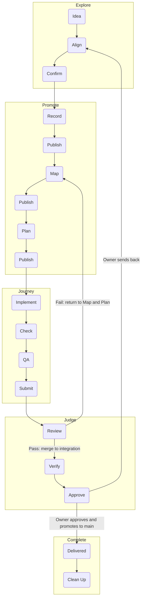
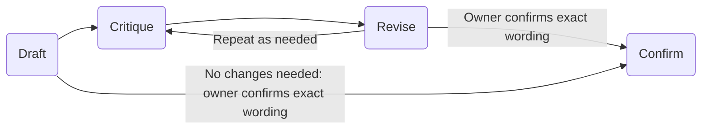

# [PROJECT_NAME] - Runbook

> Generated from LLM Workbench v[HARNESS_VERSION]. See Upgrading The Harness
> below.

**Last reviewed:** [YYYY-MM-DD]
**Blueprint reviewed:** [YYYY-MM-DD]
**Runtime owner:** [user / agent / service owner]
**Environment:** [local / LAN / staging / production]

This file explains how to operate, verify, recover, and evaluate the project. It
should be boring, exact, and executable.

## Operations Index

Every session reads this index at entry, then follows only the rows its task
needs. Each row names an operation, when following it is worth it, and the
stable pointer to where its procedure lives.
A row that points to a skill in the tracked skills lane makes that skill part
of the Contract for its operation (`AGENTS.md` Instruction Authority), so a
change to a skill an index row points to, or to an index row, is reviewed as a
Contract change.

| Operation | Follow when | Pointer |
|---|---|---|
| Write agent instructions | You create or edit skills, steering files or references agents reach through pointers. | [writing-for-agents](workbench/skills/writing-for-agents/SKILL.md) |
| Retrospect on a session | The owner explicitly requests a retrospective on a named session or the current one. | [retro](workbench/skills/retro/SKILL.md) |
| Find a workflow | You need the existing verb sequence, scenario and skill route, or the repeatable draft workflow. | [Workflows](#workflows); [Draft → Critique → Revise → Confirm](#draft--critique--revise--confirm) |
| Enter a session | Every session start or resume: check root, branch and dirty state, run doctor and load the assigned Spec. | [Ordinary Entry](#ordinary-entry) |
| Find the owner of a question | You need the file that owns a permission, meaning, work state, proof or procedure. | [Finding The Owner Of A Question](#finding-the-owner-of-a-question) |
| Route a truth to its owner | Work changed a durable truth and its owner must be updated, or nothing changed and that must be recorded. | [to-docs](workbench/skills/to-docs/SKILL.md#to-docs) |
| Cite a file that changes | A Spec, review or record cites a line of a file that later merges can move. | [to-docs](workbench/skills/to-docs/SKILL.md#citation-anchors) |
| Coordinate roles and stances | You plan, dispatch, monitor or verify work as a role or a named stance. | [Role And Stance Coordination](#role-and-stance-coordination) |
| Choose the behavior for a request | A request arrives in ordinary language and you must pick the skills and endpoint it authorizes. | [Behavior Selection](#behavior-selection) |
| Check prerequisites | A fresh machine or clone needs this project's required tools confirmed. | [Prerequisites](#prerequisites) |
| Configure the environment | Local configuration or required variables must be created or checked. | [Environment Configuration](#environment-configuration) |
| Install | You set up a fresh clone. | [Install](#install) |
| Run locally | You start the project on a local machine. | [Run Locally](#run-locally) |
| Run the tests | A change needs its fast check or the full verification. | [Test And Build](#test-and-build) |
| Verify a behavior change | A behavior change needs its red/green test, its targeted test and the full verification suite before its result is claimed. | [implement](workbench/skills/implement/SKILL.md#engineering-and-verification); this room's suite: [Test And Build](#test-and-build) |
| Hold test coverage | You add or change tests, or judge whether coverage is enough. | [implement](workbench/skills/implement/SKILL.md#test-coverage-policy) |
| Run the Workbench runtime tools | You run doctor, selection, records, decision records or diagnostics from the installed tools lane. | [Workbench Lifecycle, Diagnostics, And Decision Records](#workbench-lifecycle-diagnostics-and-decision-records) |
| Write or accept a decision record | A decision record (ADR or DDR) is proposed, accepted, superseded, deprecated, read, linked or validated. | [to-docs](workbench/skills/to-docs/SKILL.md#decision-records) |
| Read a diagnostic and its blocking effect | A runtime tool reports a finding and you need its severity and what it blocks. | [workbench-runtime](workbench/skills/workbench-runtime/SKILL.md#diagnostics-and-blocking-effects) |
| Validate the Wiki | A Wiki page changed or must move to another collection, or doctor reports a Wiki finding. | [workbench-runtime](workbench/skills/workbench-runtime/SKILL.md#wiki-validation) |
| Lint the Wiki | A Wiki update is ending (lint the pages it touched), or a Spec's work is verified and its review begins (lint the whole Wiki). | [Wiki Lint](#wiki-lint) |
| Repair installed state | doctor reports installed state that a room command rewrites. | [workbench-runtime](workbench/skills/workbench-runtime/SKILL.md#installed-state-the-harness-wrote) |
| Deliver a Spec through its lifecycle | You pick up, deliver, review or close an assigned Spec and its Tasks. | [Spec Lifecycle And Retrieval](#spec-lifecycle-and-retrieval) |
| Pick, claim and close a Task | Every pickup or resume of assigned work: selection, claim, receipt, close and blocker rules. | [implement](workbench/skills/implement/SKILL.md#work-selection-and-lifecycle) |
| Work a Task as Worker | You select, claim, implement, record receipts for, self-check, close and hand back one Task. | [implement](workbench/skills/implement/SKILL.md#worker-selection-implementation-and-hand-back) |
| Review an assembled Spec | A Dispatcher assembles a candidate, or a separate Director reviews it and records the verdict before integration. | [dispatcher](workbench/skills/dispatcher/SKILL.md#dispatcher-and-separate-director-assembled-review) |
| Correct a failed review | A verdict or owner finding failed and its findings return to the still-open Spec. | [dispatcher](workbench/skills/dispatcher/SKILL.md#assembled-review-and-corrective-return) |
| Record owner Human QA and complete | The owner approves delivered work, or main containment must be proven before `complete`. | [director](workbench/skills/director/SKILL.md#owner-human-qa-and-main-before-complete); closure rules: [director](workbench/skills/director/SKILL.md#owner-closure-and-reconciliation) |
| Capture, retire or recover a completed Spec | After `complete`: feature capture, retirement, discard or recovery. | [director](workbench/skills/director/SKILL.md#documentation-feature-capture-retirement-and-recovery) |
| Deliver a landmark through its lifecycle | You author, assign, nest a Spec or Task under, review, approve or retire a `LANDMARK.md`. | [Landmark Lifecycle](#landmark-lifecycle) |
| Allocate a visible identifier | You need a new Spec, Task, landmark, note or other visible identifier. | [workbench-runtime](workbench/skills/workbench-runtime/SKILL.md#visible-identifiers) |
| Use the Landmark Tracker | Concept understanding (DQCs, landmarks) changes, or the Tracker view is needed. | [notepad](workbench/skills/notepad/SKILL.md#landmark-tracker-accepted-design-and-available-operations) |
| Keep a JSON notepad | Meaningful work needs a local note created, resumed, appended, trimmed or cleaned up. | [notepad](workbench/skills/notepad/SKILL.md#runtime-reference) |
| Read frozen history or recovery receipts | A legacy checkpoint is cited, or a recovery receipt or backup is needed. | [checkpoint](workbench/skills/checkpoint/SKILL.md#frozen-history-and-operational-recovery) |
| Transport sessions privately | Private session transport is configured and selected collections must sync. | [save](workbench/skills/save/SKILL.md#optional-private-session-transport) |
| Save, promote or add a room-local skill | Authorized work must be saved to its owners, or the room adds its own skill. | [save](workbench/skills/save/SKILL.md#how-save-and-promote-compose); room-local skills: [workbench-runtime](workbench/skills/workbench-runtime/SKILL.md#room-local-skills) |
| Promote claims to an owner | Selected supported claims must reach their durable owner. | [promote](workbench/skills/promote/SKILL.md#command-reference) |
| Trace a name, boundary or relationship before it settles | While aligning or reworking a concept, a proposed term, boundary or relationship needs its conflicts challenged and its consequences in owners, Specs, source and tests shown before the owner chooses. | [domain-modeling](workbench/skills/domain-modeling/SKILL.md#domain-modeling) |
| Evaluate a harness change | You must show that a harness change is an improvement. | [improve-harness](workbench/skills/improve-harness/SKILL.md#improve-harness); comparative claims and trials: [Evaluation And Benchmarking](#evaluation-and-benchmarking) |
| Transfer work through a handoff | Work goes to another agent or chat as a job, investigation, report or update. | [handoff](workbench/skills/handoff/SKILL.md#transfer-procedure) |
| Improve against a benchmark | Agent rules, control docs, evaluation criteria or process change and need a baseline first. | [implement](workbench/skills/implement/SKILL.md#benchmark-driven-improvement) |
| Pick the claims to test | An evaluation must name the claim it tests. | [Claims To Test](#claims-to-test) |
| Design an evaluation | You set up task-outcome scoring or trials. | [Evaluation Design](#evaluation-design) |
| Run the evaluation commands | You run the static evaluator or the trial framework. | [Workbench Evaluation Commands](#workbench-evaluation-commands) |
| Return harness feedback | A lesson about the harness rules belongs in the feedback return channel. | [Harness Feedback Loop](#harness-feedback-loop) |
| Operate project data | The project has seed data, migrations, imports, local databases or generated feeds. | [Data Operations](#data-operations) |
| Deploy or start services | The project has deployment, scheduled jobs or service startup. | [Deployment Or Startup](#deployment-or-startup) |
| Write a PR body | A change needs its pull request description: a small visual summary, actual before/after evidence and merge danger. The skill authors the body only; opening, merging and branch cleanup stay with implement and this Runbook's Version-Control Procedures. | [pr](workbench/skills/pr/SKILL.md); open, merge and clean up: [implement](workbench/skills/implement/SKILL.md#version-control-procedures) and [Version-Control Procedures](#version-control-procedures) |
| Branch and open a pull request | You create a task branch or open a PR into integration, or need this room's Git commands. | [implement](workbench/skills/implement/SKILL.md#version-control-procedures); this room's commands: [Version-Control Procedures](#version-control-procedures) |
| Merge, prove containment and clean up a branch | A Task's merge answers are validated, or an assembled Spec candidate's Verify review passed: merge, prove integration contains it and delete the merged branch. | [implement](workbench/skills/implement/SKILL.md#branch-completion); this room's closeout commands: [Version-Control Procedures](#version-control-procedures) |
| Upgrade the harness | The project moves to a newer Workbench version. | [Upgrading The Harness](#upgrading-the-harness) |
| Write a manual harness feedback report | A setup-only Round One check succeeded and an assessment is assigned. | [Manual Harness Feedback Reports](#manual-harness-feedback-reports) |
| Troubleshoot a known failure | A command fails with a symptom listed there. | [Troubleshooting](#troubleshooting) |
| Recover or roll back | A change fails and its touched files must be restored or reverted. | [implement](workbench/skills/implement/SKILL.md#recovery-and-rollback); this room's data rules: [Recovery And Rollback](#recovery-and-rollback) |
| Record operational proof | A command changed durable project state. | [Operational Proof](#operational-proof) |
| Size and continue work | You size a Task or leave work a fresh context can resume. | [Evidence And Continuation Practices](#evidence-and-continuation-practices); [notepad](workbench/skills/notepad/SKILL.md#continuing-after-a-save-or-handoff); [save](workbench/skills/save/SKILL.md#evidence-partitioning); [to-tasks](workbench/skills/to-tasks/SKILL.md#sizing-a-task) |
| Check the Workbench connection identity | The room's `workbenchId` is created, read or compared. | [workbench-runtime](workbench/skills/workbench-runtime/SKILL.md#workbench-connection-identity) |
| Check configured-host capabilities | A host is set up, or its lanes, skill discovery or tool execution are in doubt. | [workbench-runtime](workbench/skills/workbench-runtime/SKILL.md#configured-host-capability-checks) |
| Review a candidate independently | An assembled Spec or landmark is at its Verify step and needs separate-context review, or a main-readiness or incident-claim review is requested. | [code-review](workbench/skills/code-review/SKILL.md#independent-review-boundaries) |

## Workflows

Maintain this reference with the project's confirmed workflows. It lines up
verbs, scenarios and skill pointers; definitions and governing decisions stay
with their existing owners. The reference adds no authority or new gate.

| Parent workflow | Ordered verbs | Scenario and skills |
|---|---|---|
| Explore | Idea → Align → Confirm | Reach a shared concept and endpoint with [grilling](workbench/skills/grilling/SKILL.md). Confirm ends Explore. |
| Promote | Record → Publish → Map → Publish → Plan → Publish | Consume the confirmed concept: Record uses [to-docs](workbench/skills/to-docs/SKILL.md), Map uses [to-spec](workbench/skills/to-spec/SKILL.md), Plan uses [to-tasks](workbench/skills/to-tasks/SKILL.md). [promote](workbench/skills/promote/SKILL.md) carries supported claims to their owners. |
| Journey | Implement → Check → QA → Submit | Build an assigned Task or authorized handoff using [implement](workbench/skills/implement/SKILL.md#4-review-at-the-relevant-boundary), [handoff](workbench/skills/handoff/SKILL.md) and [carry](workbench/skills/carry/SKILL.md). |
| Judge | Review → Verify → Approve | Independent [code-review](workbench/skills/code-review/SKILL.md) judges the assembled Spec, landmark or Workbench. A passing Review permits integration merge; Verify checks the reviewed work on integration; Approve is the owner's viability judgment. [dispatcher](workbench/skills/dispatcher/SKILL.md#dispatcher-and-separate-director-assembled-review) and [director](workbench/skills/director/SKILL.md#owner-human-qa-and-main-before-complete) preserve the actual gates. |
| Complete | Delivered → Clean Up | Delivered requires the owner's approval and main promotion. [Owner closure](workbench/skills/director/SKILL.md#owner-closure-and-reconciliation) retains main containment, completion and knowledge reconciliation before cleanup. |



Promote begins with an already-confirmed concept. A nearer authorized endpoint
limits the run; unclear or changed scope returns for clarification. Each Publish
makes that stage's records available from integration before the next stage
depends on them. It implies neither Spec completion nor main promotion.
Review applies to an assembled destination, never a Task. A failed Review
returns to Map, Plan and Journey under the still-open Spec through the existing
[corrective return](workbench/skills/dispatcher/SKILL.md#assembled-review-and-corrective-return).
Owner Human QA, owner-only main promotion, main verification and cleanup remain
in force. These parent labels relax no safeguard.

Off-path arrivals use [genesis](workbench/skills/genesis/SKILL.md),
[adoption](workbench/skills/adoption/SKILL.md),
[update-harness](workbench/skills/update-harness/SKILL.md) or
[version-control recovery](#version-control-procedures) for the actual scenario.
A room-local readback may support Align → Confirm without adding an invocation
gate. Maintain the project's confirmed reference here; do not duplicate verb
definitions or weaken its owner's endpoint.

### Draft → Critique → Revise → Confirm

Use this workflow when the owner needs to inspect proposed artifact wording:
show the actual draft with its context and sources, invite critique, revise it,
and ask for confirmation of the exact wording shown. Critique and revision are
repeatable as needed before Confirm. A comment or change request is not approval
or confirmation. Preserve exactly what was confirmed; a later revision needs
its own confirmation before it can replace the approved text.



This is not a mandatory extra gate for every trivial interaction. Explore still
ends in Confirm and can contain different workflows; this addition does not
settle their taxonomy or change the five parent workflows above. The Workbench
owner confirmed this workflow and its three new verbs on 2026-10-08. Confirm
already existed. The new verb definitions follow below.

**New verb definitions.**

| Verb | Meaning |
|---|---|
| **Draft** | Show the actual proposed artifact text, with enough context and source links for the owner to judge it. Proposed wording remains a draft until Confirm; existing source records remain authoritative. |
| **Critique** | Evaluate a visible draft and give feedback about what should change and why. A comment or change request is not approval or confirmation. Critique and revision can repeat as needed before Confirm; critique alone does not change the authoritative source. |
| **Revise** | Change the proposed artifact text in response to critique, retaining context for the next reading. Show the revised draft for further critique or exact-text Confirm. An earlier confirmation does not approve later revisions; preserve exactly what was approved. |

Vocabulary destination: these new definitions belong in the room's established
`GLOSSARY.md`. If its glossary migration is pending, retain them in this
workflow reference until they can move to that owner; do not add new legacy
Lexicon entries or create a second Glossary.

## Ordinary Entry

Follow `AGENTS.md` -> this section -> `LEXICON.md` -> Task Routing. Inspect the
root, branch, upstream and dirty state; run the project-local spec doctor and
load the explicitly assigned spec. For owner-directed pickup, use `next --json`
and `show` to resolve that assignment. The spec and task set the normal
stance. Investigate within the task; do not invent a next task when blocked.
Load remaining Runbook sections only for the operation being performed.

For a setup-only Round One assignment, a fresh agent follows that route, checks
the manifest, relevant Wiki and ADRs, and runs read-only configuration checks.
Return the result in chat only: no feedback report, handoff, checkpoint,
self-created task, or other delivered prose artifact. Internal JSON capture
follows the meaningful-work rule and is reconciled at closeout; it does not
turn a chat-only setup check into a reporting assignment. Round One precedes
feedback testing.

### Finding The Owner Of A Question

1. Use [LEXICON -> Artifact Ownership Schema](LEXICON.md#artifact-ownership-schema)
   to identify the job: permission, meaning, destination, work state, proof,
   procedure, recovery or another listed responsibility.
2. Follow the named owner and resolve installed paths through the manifest.
   Consult only the relevant section and its linked sources. For a work-state
   question, follow the Taskboard row to the owning Spec before editing.
3. Separate the answer's status: accepted requirement, verified observation,
   proposal, unresolved question or historical claim. Apply AGENTS State
   Resolution if sources disagree; file location alone does not settle it.
4. When authorized work changes the answer, update its owner and refresh any
   derived view. If the route is missing, use bounded search and repair that
   route in scope. An unresolved decision stays in the existing work owner or
   objective note; a missing answer does not authorize a new task.

For example, a failed test has several owners: the Spec defines the expected
behavior, the source implements it, the result records the failure, and the
Spec records any resulting blocker. A Wiki explanation may clarify the cause;
it does not redefine acceptance. After interruption, the Runbook supplies the
recovery procedure while the Spec, source and saved context supply what to
recover. Execution and recovery therefore remain separate jobs.

### Role And Stance Coordination

Roles scope assignments; stances supply their job. Follow the Lexicon before
assigning Director (project/integration), Dispatcher (one Spec/branch) or Worker
(one Task). At flight launch, assign Spec Planner to plan small Tasks and safe
parallel groups from current Actuality; planning Workers may assist. Assign
Spec Manager to dispatch and monitor execution. Keep one writer for shared
Spec/projection state. Coordinate cross-Spec dependencies with the Director
when present; otherwise delegate only necessary directly connected prerequisite
Tasks to Workers, preserving original ownership, claims and proof. Dispatchers
orchestrate all implementation and corrections; missing Worker capabilities
leave a recoverable blocker, never a Dispatcher implementation fallback.

Use Reviewer or Auditor stance for the named verification job. Apply the
existing independent-review eligibility rules to the actual agent/context;
changing stance does not clear prior involvement. Normally Workers hand back
merge requests to the Dispatcher branch and the Dispatcher presents the
assembled candidate for review and merge into integration. Inspect the current
release owner for any bootstrap exception before selecting a target.

Reconcile accepted decisions, current progress, off-integration candidate
references and remaining gates into their existing tracked owners through
reviewed changes. Distinguish a documented decision, an unmerged candidate and
a delivered capability. Create no Tasks for a newly planned Spec until launch;
preserve already-authored Tasks and their evidence.

### Behavior Selection

After resolving the requested scope, compose the smallest behavior already
authorized by ordinary language; do not wait for a second skill invocation.

| User intent | Behavior and endpoint |
|---|---|
| Decide or stress-test an idea | `grill-me`, the entry composing `grilling` with `notepad`; save answers/corrections before continuing |
| Preserve or resume meaningful work | `notepad`; verify live state and returned revision |
| Reconcile agreed claims | `promote` with `to-docs` and `save`; no implied implementation |
| Write specifications only | `to-spec` and needed `to-tasks`; stop at the specified endpoint |
| Deliver assigned work | `carry` with `implement`, verification, Task merge answers, independent Verify review of the assembled Spec and `save` |
| Transfer a job or report to another context | core `handoff`; recipient purpose, instructions and context within assigned role scope |
| Review a candidate or readiness | `code-review`; report only, no implementation or main merge |

Every helper inherits the caller's narrower endpoint. Mention is not invocation
and invocation is not new authority. Optional routers and historical extension
skills are not prerequisites. For meaningful work, create/resume a JSON note,
read its revision, verify Actuality and correct stale state before dependent
work. Confirm successful append/current results after material changes and
validate/read back before voluntary pause or handoff. Runtime revision, privacy
and dependency checks enforce those operations; host-native interception of
arbitrary agent actions is not claimed.

## Prerequisites

Required tools:

- [tool and version]
- [tool and version]

Required accounts/services:

- [service]
- [service]

Required local files:

- `[path]` - [purpose / how to create safely]

## Environment Configuration

Create local config from the example:

```bash
[COPY_ENV_COMMAND]
```

Required variables:

| Variable | Purpose | Secret? | Example / Notes |
|---|---|---|---|
| `[ENV_VAR]` | [purpose] | [yes/no] | [placeholder only] |

Rules:

- Do not commit real `.env` files, tokens, local databases, logs, or private
  data.
- Keep secrets server-side or local-only.
- Prefer degraded states over fake data when an external source is unavailable.

## Install

```bash
[INSTALL_COMMAND]
```

Expected result:

- [what success looks like]

## Run Locally

```bash
[RUN_COMMAND]
```

Open:

- [local URL, CLI command, or service endpoint]

Expected result:

- [health response / visible UI / log line]

## Test And Build

Fast check (the targeted test for a change):

```bash
[FAST_TEST_COMMAND]
```

Full verification is the one full verification suite list below. `AGENTS.md`
[Engineering And Verification](AGENTS.md#engineering-and-verification) requires
it to pass before a change's result is claimed; the red/green steps and their
order follow the
[`implement` skill](workbench/skills/implement/SKILL.md#engineering-and-verification).

```bash
[FULL_TEST_COMMAND]
[BUILD_COMMAND]
[LINT_OR_AUDIT_COMMAND]
[SPEC_DOCTOR_COMMAND]
```

Expected result:

- [pass condition without hardcoding stale counts unless recently verified in
  `TASKBOARD.md`]

### Test Coverage Policy

Treat tests as the project specification: if someone accidentally deletes a
meaningful line, at least one test or documented manual check fails, and tests
that are stale or pure bloat are removed. The coverage rules follow the
[`implement` skill](workbench/skills/implement/SKILL.md#test-coverage-policy).

## Workbench Lifecycle, Diagnostics, And Decision Records

The project runs its own installed runtime tools from the manifest-declared
tools lane:

```bash
node workbench/tools/spec-workbench.mjs next --json
node workbench/tools/spec-workbench.mjs show S-###
node workbench/tools/spec-workbench.mjs claim S-### --agent NAME
node workbench/tools/spec-workbench.mjs claim LMK-### --agent NAME
node workbench/tools/spec-workbench.mjs close S-### --proof "..." --docs "..." --remaining-gap "..."
node workbench/tools/spec-workbench.mjs render
node workbench/tools/spec-workbench.mjs doctor
```

Selecting, claiming and closing work with these commands follows the
[`implement` skill](workbench/skills/implement/SKILL.md#work-selection-and-lifecycle).
`doctor` prints every registered finding with its severity and blocking effect;
what each finding means and blocks, including the `attention` findings that
stay visible without blocking, follows the
[`workbench-runtime` skill](workbench/skills/workbench-runtime/SKILL.md#diagnostics-and-blocking-effects),
and validating the wiki lane follows its
[Wiki Validation](workbench/skills/workbench-runtime/SKILL.md#wiki-validation) section.
A Spec may nest in its landmark's `specs` folder under `workbench/landmarks/`,
and a Task may sit directly under an assigned, active landmark; the
[Landmark Lifecycle](#landmark-lifecycle) section names the landmark commands.
Decision records live in `workbench/docs/adr/` and Destination Decision Records
in `workbench/docs/ddr/`; writing, accepting, superseding, deprecating, reading
and validating them follows the
[`to-docs` skill](workbench/skills/to-docs/SKILL.md#decision-records).

### Spec Lifecycle And Retrieval

Use this sequence for one assigned Spec and its Task records. Examples name
S-001/TK-001; substitute the actual IDs and quoted values. These are separate
role checkpoints, not one unattended script: a Worker supplies self-check,
the Dispatcher owns whole-Spec QA, a separate Director reviews the immutable
candidate, and only the owner supplies Human QA approval and main promotion.
Review and owner actions are separate responsibilities, never an unattended approval script.
Each role's procedure lives in the lane skill its subsection below points to.

#### Worker: selection, implementation and hand-back

Select, claim, implement, record receipts for, self-check, close and hand back
one Task through the procedure in the
[`implement` skill](workbench/skills/implement/SKILL.md#worker-selection-implementation-and-hand-back).

#### Dispatcher and separate Director: assembled review

Assemble a Spec candidate, review it in a separate context, record the verdict,
return failed findings and check the gate before integration through the
procedure in the
[`dispatcher` skill](workbench/skills/dispatcher/SKILL.md#dispatcher-and-separate-director-assembled-review).

#### Owner: Human QA and main-before-complete

Record the owner's actual Human QA decision and complete a Spec after main
containment through the procedure in the
[`director` skill](workbench/skills/director/SKILL.md#owner-human-qa-and-main-before-complete).

#### Documentation: feature capture, retirement and recovery

Capture feature knowledge, retire, discard and recover a completed Spec, and
recover a colliding Task identity, through the procedure in the
[`director` skill](workbench/skills/director/SKILL.md#documentation-feature-capture-retirement-and-recovery).

### Visible Identifiers

Allocate and widen the visible identifiers of Specs, Tasks, decision records
and notepads through the procedure in the
[`workbench-runtime` skill](workbench/skills/workbench-runtime/SKILL.md#visible-identifiers).

### Landmark Lifecycle

A landmark is a `LANDMARK.md` artifact one size above a Spec
(the room's landmark decision record, if it has one):
its folder `workbench/landmarks/LMK-###-slug/` holds `LANDMARK.md`, its child
Specs in its `specs` folder and its direct Tasks in `tasks/`, each with a
`retired/` lifecycle folder. Copy `templates/LANDMARK.md`; `doctor` reports a broken
artifact as `malformed-landmark` and a misnamed folder as `unstable-path`.
Examples name LMK-001, S-001 and TK-001; substitute the actual IDs and quoted
values. The room's Wiki article on landmarks, if it has one,
explains the model.

```bash
node workbench/tools/spec-workbench.mjs next-id --prefix LMK --json
node workbench/tools/spec-workbench.mjs move-spec S-001 --landmark LMK-001
node workbench/tools/spec-workbench.mjs move-spec S-001 --landmark none
node workbench/tools/spec-workbench.mjs claim LMK-001 --agent NAME
node workbench/tools/spec-workbench.mjs show LMK-001
node workbench/tools/spec-workbench.mjs receipt LMK-001 --task TK-001 --tests "..." --docs "..." --remaining-gap "..."
node workbench/tools/spec-workbench.mjs close LMK-001 --proof "..." --docs "..." --remaining-gap "..."
node workbench/tools/spec-workbench.mjs gate --task TK-001 --landmark LMK-001
node workbench/tools/spec-workbench.mjs move-task LMK-001 --task TK-001 --to retired
node workbench/tools/spec-workbench.mjs report LMK-001 --candidate SHA
node workbench/tools/spec-workbench.mjs verify LMK-001
node workbench/tools/spec-workbench.mjs verdict LMK-001 --candidate SHA --digest DIGEST --result pass|fail --findings "..." --reviewer "..."
node workbench/tools/spec-workbench.mjs approve LMK-001 --candidate INTEGRATION_SHA --digest DIGEST --owner "..."
node workbench/tools/spec-workbench.mjs retire-landmark LMK-001 --wiki workbench/wiki/design-concepts/landmark-[slug].md
```

- `move-spec --landmark LMK-###|none` moves an active-roster Spec into a
  landmark, between landmarks or back to `workbench/specs/` through the
  link-safe move: every live reference is rewritten, historical ones counted,
  and the moved record's links to unmoved files recomputed. It never combines
  with `--to`, and it does not edit the landmark's Child Specs list.
- A Task directly under a landmark names `**Landmark ID:**` in place of
  `**Spec ID:**`. `next` and `claim LMK-###` offer it only while the landmark is
  `active` and its Owner is not `unassigned`; `close` appends to the landmark's
  evidence log, and `gate --task --landmark` reports its Task PR under the same
  exemption a Spec's Task PR uses.
- `report`, `verify` and `verdict` on a landmark are the whole-landmark review:
  `verify` refuses while a child Spec is neither complete nor retired or a
  direct Task is not done; `verdict` refuses a reviewer who took part in the
  landmark, including every agent a direct or child Task record lists under
  `Claimed by` (each `claim` appends its agent there and refuses an agent name
  with a comma or line break), answers a fail with corrective Tasks under the landmark without
  touching a child Spec's gate, and sets the landmark `reached` on a pass with
  every child closed and every reached check ticked.
- `approve LMK-###` records only the owner's actual approval, bound to the
  landmark's committed content; it records no owner finding.
- `retire-landmark LMK-### --wiki PAGE` refuses by name until the landmark is
  reached with no open child, a current pass verdict, a clean tree, the owner's
  approval and a Landmark Wiki page in the Wiki lane whose `source_paths` names
  the historical `LANDMARK.md` route; then it moves the whole folder to
  `workbench/landmarks/retired/`, staged and uncommitted.

A landmark-direct Task executes only under an assigned landmark until the
Instruction Authority list in `AGENTS.md` names an assigned landmark.

### Landmark Tracker: accepted design and available operations

The Landmark Tracker's accepted design and the operations available now are
carried by the
[`notepad` skill](workbench/skills/notepad/SKILL.md#landmark-tracker-accepted-design-and-available-operations).

### JSON Notepads

Create, resume, read, append to, trim, migrate or delete a local JSON notepad,
and allocate its visible identifier, through the procedure in the
[`notepad` skill](workbench/skills/notepad/SKILL.md#runtime-reference).

### Frozen History And Operational Recovery

Existing checkpoints stay frozen, and recovery receipts and backups live in the
ignored recovery collection; read or restore them through the procedure in the
[`checkpoint` skill](workbench/skills/checkpoint/SKILL.md#frozen-history-and-operational-recovery).

### Optional Private Session Transport

Configure, push, resume and reconcile optional private session transport
through the procedure in the
[`save` skill](workbench/skills/save/SKILL.md#optional-private-session-transport);
ordinary local notepad commands stay independent of it.

### Portable Save, Promote And Room-Local Skills

How `save` and `promote` compose is in the
[`save` skill](workbench/skills/save/SKILL.md#how-save-and-promote-compose).
Adding a room-local skill to the lane, and checking the lane it joins, follows
the [`workbench-runtime` skill](workbench/skills/workbench-runtime/SKILL.md#room-local-skills).
The core catalog rules follow.

The core machine catalog is `coreSkills` in the layout runtime; documentation
and tests derive its size from that catalog. The current candidate includes
save/promote while preserving checkpoint as a no-write compatibility notice.
The v3.1.4 eighteen-skill manifest policy remains readable as a frozen legacy
row; adding candidate source does not publish or stamp v3.2.0.

### Direct Owner Promotion

Reconcile selected supported claims into an existing durable owner with
`sessions.mjs promote` through the procedure in the
[`promote` skill](workbench/skills/promote/SKILL.md#command-reference).

### Wiki Lint

Lint is a reading job an agent performs; no command does it, and
`node workbench/tools/wiki.mjs validate` keeps
running on every change without replacing it. The obligation and its two
cadences are owned by [`AGENTS.md`](AGENTS.md#documentation-ownership-and-proof)
and [`workbench/wiki/SCHEMA.md`](workbench/wiki/SCHEMA.md#lint); this section
is the checklist, not a second statement of them.

**Small lint, at the end of every Wiki update, on the pages it touched:**

1. Run `wiki.mjs validate`. The touched pages add no finding: properties,
   collection shape, relative links and sources are the validator's, not the
   reader's.
2. Read each touched page against the pages it links to and the pages that
   link to it. It contradicts none of them.
3. Every claim still has its source. A claim checked in this operation is
   stated plainly; an inferred claim says `Inference:`; a dated one says its
   date. `last_verified` moved only for facts actually checked
   ([SCHEMA Update](workbench/wiki/SCHEMA.md#update)).
4. The router `workbench/wiki/MEMORY.md` links the page with a one-line
   summary, and the summary still says what the page now says.
5. Every identifier on the page carries the artifact's name and a little
   context. Add what is missing; never strip an identifier.
6. Each truth lives once: the page links to its owner (Spec, decision record,
   Lexicon, Runbook) instead of restating it, and copies no live task state.
7. No concept the page mentions lacks a page or a Lexicon row it should have.
8. An article in `design-concepts/` or `features/` has its `History` line for
   this operation, and a design concept's `authorized_by` names it.

Repair what the update itself can fix on the same branch. A finding not
resolved in the update becomes a corrective Task under the owning, still-open
Spec ([SCHEMA Lint](workbench/wiki/SCHEMA.md#lint)); it is not left unrecorded.

**Whole-Wiki lint, at Spec review when the Spec's work is verified:** the
agent doing the review reads every page against the current controls and the
question cards, asking the small-lint questions across the whole Wiki and
these:

- Does any page contradict `AGENTS.md`, the Lexicon, an active decision record
  or the schema?
- Is any page stale (marked `status: stale` and not repaired) or orphaned
  (not routed from the router, or with a link or source that no longer
  resolves)?
- Does every delivered capability have its article in `workbench/wiki/features/`?
- Does every router summary line still describe its page?
- Does each landmark's synthesis page still match its question cards' current
  answers?

Each finding becomes a corrective Task under the still-open Spec, following
the [assembled review and corrective return](workbench/skills/dispatcher/SKILL.md#assembled-review-and-corrective-return)
rule in `AGENTS.md`; it is not cleared by a green `validate`.

## Evaluation And Benchmarking

Use this section to prove whether the workbench or project process is improving.
The goal is evidence, not taste.
Improving one harnessed job, from its baseline through a fresh rerun to a
retain, revise or remove decision, follows the one loop in the
[`improve-harness` skill](workbench/skills/improve-harness/SKILL.md#improve-harness);
a comparative claim needs the claims, design and trials below.

### Handoff Transfer

Prepare a handoff for a specified receiving context and release a retaining
source through the procedure in the
[`handoff` skill](workbench/skills/handoff/SKILL.md#transfer-procedure), within
the [role boundaries](AGENTS.md#handoff-assignments-and-shared-context).

### Benchmark-Driven Improvement

Capture the available guardrail or benchmark baseline before changing agent
rules, control docs, evaluation criteria, or the working process. The procedure
follows the
[`implement` skill](workbench/skills/implement/SKILL.md#benchmark-driven-improvement).

### Claims To Test

The harness or process is only worth calling better when it can support at least
one of these claims:

1. Better than no project instructions.
2. Better than a representative generic instruction file.
3. Better than the prior version on the same task suite.

### Evaluation Design

Use controlled conditions:

| Condition | What the agent gets | Purpose |
|---|---|---|
| `c0_none` | no project instructions | baseline |
| `c1_generic` | a generic `AGENTS.md` / `CLAUDE.md` style file | common alternative |
| `c2_current` | current project or template docs | current candidate |
| `c3_candidate` | proposed branch or changed docs | improvement test |

Score task outcomes, not how good the docs feel. Useful dimensions:

| Dimension | What it measures |
|---|---|
| Correctness | hidden or independent acceptance check passes |
| Scope adherence | changed files stay inside the task allowlist |
| Verification honesty | final claims match independently rerun checks |
| Docs upkeep | stale docs were updated or explicitly marked unchanged |

Run multiple trials per condition when using stochastic agents. Report effect
size and confidence interval when possible. Do not claim broad proof from one
run.

### Workbench Evaluation Commands

For this template repo, the static evaluator checks control-surface coverage:

```bash
node tools/test-evaluate-workbench.mjs
node tools/evaluate-workbench.mjs --path . --include-controls
```

The runnable trial framework lives in `evals/`:

```bash
python3 evals/results/_make_selftest.py
python3 evals/score.py evals/results/_pipeline_selftest.jsonl --baseline c0_none
```

Real comparison runs may spend API budget. Size the run first and record the
model, conditions, task suite, trial count, and result path before making claims.

### Harness Feedback Loop

This project's `WORKBENCH_FEEDBACK.md` is the return channel to the upstream
harness. Lessons logged there feed harness changes, which must clear the same
bar as any other "better" claim: a proposed template change is `c3_candidate`
above, tested against the current docs on the same task suite before it ships.
Feedback flows out; validated improvements flow back in as a harness upgrade
(Upgrading The Harness, above). Taste alone never closes the loop; evidence does.

## Data Operations

Use this section only if the project has seed data, migrations, imports, local
databases, or generated feeds.

Seed/import:

```bash
[SEED_OR_IMPORT_COMMAND]
```

Migration:

```bash
[MIGRATION_COMMAND]
```

Backup/restore:

```bash
[BACKUP_OR_RESTORE_COMMAND]
```

Safety rules:

- [what data this command may modify]
- [what it must never modify]
- [how to verify counts/schema/output]

## Deployment Or Startup

Use this section only if the project has deployment, LaunchAgent, cron,
scheduler, or service startup behavior.

Start/restart:

```bash
[START_OR_RESTART_COMMAND]
```

Stop:

```bash
[STOP_COMMAND]
```

Logs:

```bash
[LOG_COMMAND]
```

Expected healthy state:

- [process, endpoint, scheduler, or deployment check]

## Version-Control Procedures

Branching, pull requests, merge, containment proof and cleanup follow the
[`implement` skill](workbench/skills/implement/SKILL.md#version-control-procedures)
and its [branch completion](workbench/skills/implement/SKILL.md#branch-completion)
procedure; this section keeps this room's commands for them.

Git authority and policy live in `AGENTS.md` -> Git Rules. Keep executable
commands and expected results here:

```bash
[STATUS_COMMAND]
[CREATE_TASK_BRANCH_COMMAND]
[DIFF_CHECK_COMMAND]
[CREATE_PR_COMMAND]
```

Expected result: [clean scope, verified base/target, reviewable PR].

Closeout, once the Task's merge answers are validated or the Spec candidate's
Verify review has passed. A pushed branch is
recoverable, not delivered; finish the merge and clean up after yourself:

```bash
(
set -eu
[MERGE_PR_COMMAND]
[VERIFY_INTEGRATION_CONTAINS_WORK_COMMAND]
)
```

After successful verification, if cleanup is authorized:

```bash
[DELETE_MERGED_BRANCH_COMMAND]
git worktree prune
```

Expected result: [integration contains the work; merged branch deleted locally and remotely; unmerged work never force-deleted].

## Upgrading The Harness

These control docs were generated from a specific LLM Workbench version, recorded
in the `Generated from LLM Workbench v[HARNESS_VERSION]` stamp at the top of each
doc. That stamp lets you tell when the project is running an older harness than
the current one.

To upgrade:

1. Check the clean LLM Workbench release checkout's releases/changelog for what changed since
   `v[HARNESS_VERSION]`.
2. Re-copy only the changed template sections; keep this project's filled-in
   specifics. Never let `[BRACKETED]` placeholders leak back into filled docs.
   Land a changed operations index only after step 3, so every row points to a
   skill this project's lane holds; keep this project's own index rows and
   sections, any divergence it recorded and any skill it added to the lane. The
   control fidelity report's generation labels tell the template's changes from
   this project's own.
3. Update managed runtime tools only with that checkout's
   `node tools/workbench-tools.mjs update --project PATH --home HOME --explicit-update`
   and the managed core skills only with
   `node tools/workbench-skills.mjs update --project PATH --home HOME --explicit-update`;
   keep each receipt and backup as that component's recovery point.
4. Update each doc's version stamp to the new version. Do not rewrite the room
   manifest's historical adoption source to impersonate the newly installed
   component generation.
5. Re-run the full verification suite and record the upgrade in its owning spec.

An update of the canonical Workbench itself also requires a separate
Workbench self-drift check before and after the change. Inspect the source
controls, Specs and projections, manifest, ADR/Wiki routes, procedures,
templates, managed artifacts and readable continuity metadata for stale
current-facing statuses, blockers, versions, paths and owners. A target-project
drift report, render, doctor or passing tests do not replace this check. In the
source Workbench, run `node workbench/tools/self-drift.mjs --phase pre --json`
and `--phase post --json` around the change, then record the bounded semantic
check. Machine output alone does not certify freshness; do not call the source
update clean while known current-facing
drift remains. Preserve explicitly bounded historical evidence.

The runtime tools in `workbench/tools/` are Workbench-managed: their receipt
(`.workbench-tools.json`) records the exact source release, commit, and file
hashes. Verify them with `node /PATH/TO/LLM_WORKBENCH/tools/workbench-tools.mjs verify --project .`
and replace them only through `update --explicit-update`, which backs up the
previous files and records a rollback path. Never hand-edit a managed tool.

This project's own `node workbench/tools/spec-workbench.mjs doctor` runs the
same receipt hash check from the tools this project carries, so a hand-edited
managed tool fails the check here with no release checkout present. It fails at
the `all` effect, which also makes `next` and `claim` refuse until the runtime
is repaired. The check runs only when `workbench/tools/` carries a receipt; a
receipt that cannot be read, records no file hashes, names a file outside that
lane, or does not account for every managed tool is reported as
`tools-receipt-missing` rather than switching the check off. That last one
matters because the drift report names the file it found: deleting that key
would otherwise switch the check off for exactly the hand-edited tool. The
authoritative list of what is managed ships inside the installed tools
themselves, so a receipt is checked against that list and not against whatever
the lane happens to hold - a managed tool deleted along with its key is still
named. Dotted entries are skipped.

The two coverage conditions have different repairs. A managed tool the receipt
does not account for is refreshed with `update --explicit-update` from the
release checkout, which rewrites the lost key and restores a deleted managed
file. A file the managed runtime does not include has to be moved out of the
lane instead: `update` cannot adopt it and reports `current`, and `install`
refuses a lane that already carries a receipt.

Without a release checkout `doctor` cannot say whether the receipt went stale
or the bytes were changed - it reports every drifted file as
`source-unavailable` - so run `verify` from the release checkout to classify
it. A deleted receipt is the readiness gate's finding, not this check's. A
deleted managed tool that another managed tool imports stops `doctor` from
loading at all, so what appears is a loader stack trace rather than a finding.

The source checkout must have a concrete `origin` and 40-character `HEAD`, and
its managed source lane must be clean; otherwise install/update refuses before
creating a receipt or backup.

Managed-tool updates and rollbacks reject symlinked lane ancestors, linked or
nonregular managed files, and unsafe backup entries before copying or creating
backups. Resolve the path collision while preserving its target, then retry the
explicit operation. Ordinary drift in a regular managed file still receives a
backup and can be restored.

Layout initialization and schema migration preserve existing session ignore
rules and reject linked destination paths before writes. ADR creation, register
rendering and direct owner promotion also reject unsafe destination chains and
use private temporary files; direct promotion refuses a `--from` source
outside the repository root, or one reached through a symbolic link, with
`invalid-note` and writes nothing. Legacy Wiki adoption moves existing
knowledge before seeding only the missing contract files.

Treat a harness upgrade like any other change: smallest correct diff, verified,
with proof. If a downstream lesson should flow *back* to the harness, capture it
per the project's `WORKBENCH_FEEDBACK` convention.

## Manual Harness Feedback Reports

Run this workflow after a setup-only Round One check succeeds. It assesses the
assigned target; it never authorizes a repair or invokes automated repair.

1. Resolve `lanes.feedback`, `lanes.specs` and the relevant collections through
   `workbench/manifest.json`. Pin the target revision and the assigned question.
2. Inspect only relevant controls, source and named proof. Test consequential
   claims, distinguish observation from inference, and disclose evidence limits.
3. Write `REPORT-topic-date.md` in the declared feedback lane using its
   `REPORT_FORMAT.md`. Include Target And Scope, Evidence And Limitations,
   Findings, Challenged Or Rejected Findings, Next Action And Open Questions,
   and Review Boundary. Every finding requires exactly one Lexicon disposition,
   recorded in its owning Spec with an evidence route; missing ownership stays
   an explicit gap. No findings is valid. Reports never live loose or in
   the Wiki. If the format is absent in an older installation, these sections
   are sufficient; explicit upgrades may copy it from the source templates.
4. Put accepted follow-up work in its existing linked spec; proposed repairs
   remain pending owner authorization. A report is not a work assignment.
5. At a meaningful continuation boundary, a fresh session should find the report,
   its linked spec, and the next executable action or owner gate using repository
   state only. No universal handoff or new self-created task is required.
6. At the Spec's Verify step, the assembled candidate's separate-context review
   challenges the report's consequential claims and recommendations along with
   the change.

## Troubleshooting

| Symptom | Likely cause | Check | Fix |
|---|---|---|---|
| [Symptom] | [cause] | `[command/check]` | [fix] |

## Recovery And Rollback

Recover from a failed change through the procedure in the
[`implement` skill](workbench/skills/implement/SKILL.md#recovery-and-rollback).

Do not delete data, reset databases, rewrite history, or rotate secrets unless
the user explicitly approves that action.

## Operational Proof

If a command changed durable project state, append evidence to the owning spec.
For routine read-only runs, a final response note is enough.

## Evidence And Continuation Practices

Sizing a Task follows the
[`to-tasks` skill](workbench/skills/to-tasks/SKILL.md#sizing-a-task).

Continuing after a save or a handoff follows the
[`notepad` skill](workbench/skills/notepad/SKILL.md#continuing-after-a-save-or-handoff),
and partitioning an evidence record follows the
[`save` skill](workbench/skills/save/SKILL.md#evidence-partitioning).

How the claim-age diagnostic counts a claim's age follows the
[`workbench-runtime` skill](workbench/skills/workbench-runtime/SKILL.md#diagnostics-and-blocking-effects).

Amending an existing decision record before adding a new one follows the
[`to-docs` skill](workbench/skills/to-docs/SKILL.md#decision-records).

Keep setup human-readable and staged through the documented Genesis, adoption
and explicit-upgrade routes. Verify every consumed source lane before mutation,
then installed behavior in the actual room. Project-owned schemas/templates and
promoted Wiki knowledge travel in project Git; optional private session transport
handles live working context separately. A clean upstream test is not downstream
acceptance. Recheck actual destination refs and preserve unknown remote state.

### Workbench connection identity

Assign, read and compare the room's `workbenchId` through the procedure in the
[`workbench-runtime` skill](workbench/skills/workbench-runtime/SKILL.md#workbench-connection-identity).

### Configured-host capability checks

Check what a configured host can actually do (writable lanes, native skill
discovery and invocation, managed-tool execution) through the procedure in the
[`workbench-runtime` skill](workbench/skills/workbench-runtime/SKILL.md#configured-host-capability-checks).

## Independent Review Boundaries

Verify review of an assembled Spec, main-readiness review and incident-claim evidence
follow the
[`code-review` skill](workbench/skills/code-review/SKILL.md#independent-review-boundaries).
